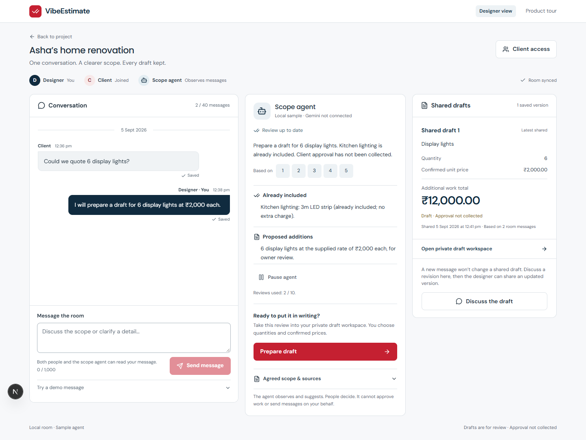
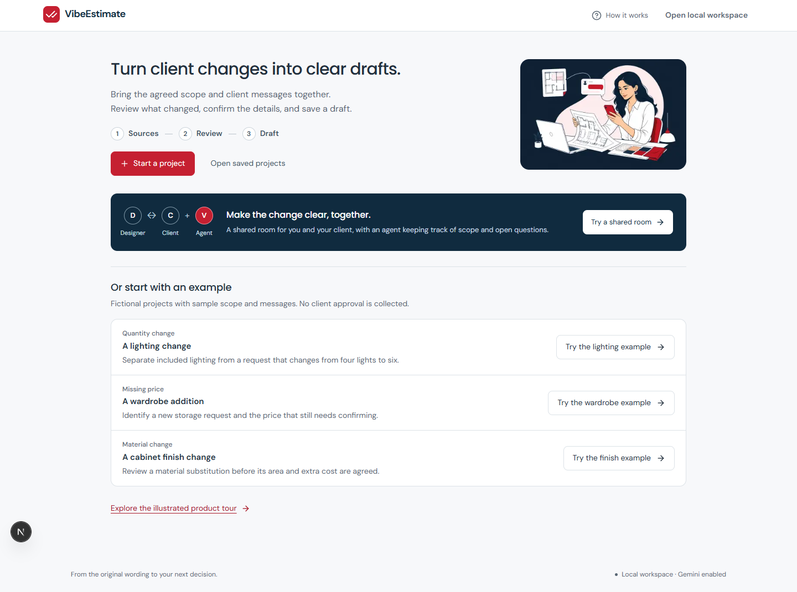
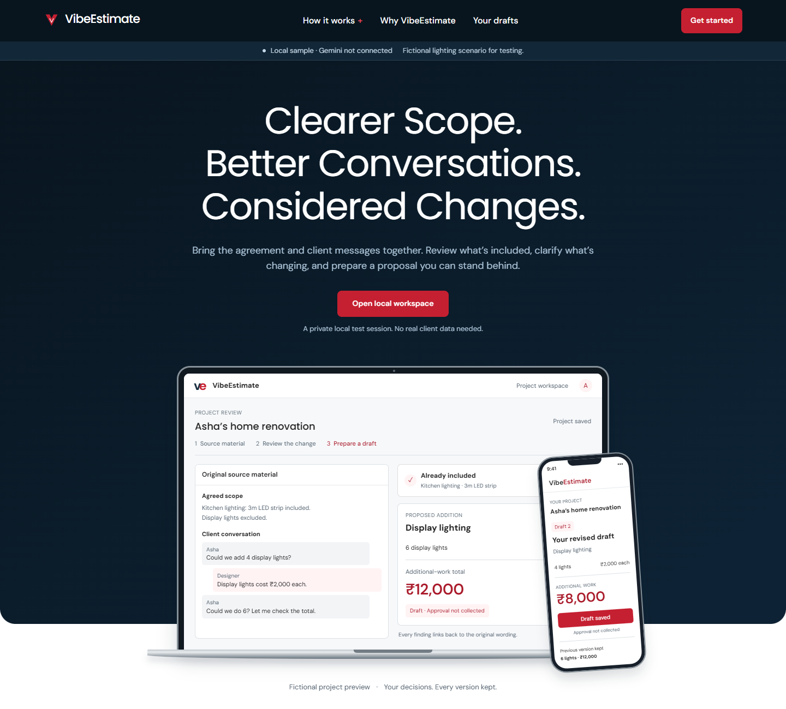

# VibeEstimate

Turn an agreed project scope and client messages into a reviewable change proposal. See what is included, clarify proposed additions, and revise a draft without losing its history.

This repository is the local foundation for a Google Cloud Gen AI Academy submission. The frontend uses the official Next.js setup and shadcn/ui. A TypeScript API verifies Firebase identities, isolates Firestore records, and calls the Google GenAI SDK when live mode is configured.

## Try locally

Requires Node.js 22.17+ and Java 21. All downloaded npm dependencies, emulator files, browser binaries, and MCP configuration stay in this project.

~~~sh
npm ci
npm run setup
npm run dev
~~~

Open **http://127.0.0.1:3000**. The API is at **http://127.0.0.1:8080/health**, and the Firebase emulator UI is at **http://127.0.0.1:4000**.

The home workspace explains Sources → Review → Draft. Choose **Start a project** for the two-step source form, or **Try the lighting example** to explore immediately. Saved projects show where to resume. The original navy/red landing page, illustrations and interactive product story remain at **http://127.0.0.1:3000/welcome**, linked from home.

For the complete collaborative demo, choose **Try a shared room**. In the room, choose **Invite client → Create invite link → Open client demo**. The new tab uses a separate client identity. Exchange messages between both tabs and watch the source-linked agent review update. The designer can prepare a private draft, return with **Back to room**, and **Share saved draft** so the client receives that saved version. Both interfaces run on port 3000 with the same authenticated API; no second server is needed.

The default runner uses a demo Firebase project and local Auth/Firestore emulators. Its AI provider is a clearly labeled, deterministic lighting fixture. It does not call paid Gemini services and does not access production Firebase data. Arbitrary scope analysis requires the real Gemini provider and server credentials.

The sample demonstrates included kitchen lighting, a proposed display-light addition, a six-light draft at ₹12,000, and a four-light revision at ₹8,000. Amounts are fictional item subtotals. Client approval is not collected.

Follow the [demo walkthrough](docs/demo-walkthrough.md) for the complete story. For live Gemini with local Firebase emulators, use the private Vertex configuration in [local setup](docs/local-setup.md). Real Gemini reviews, clarification, drafts, revisions, persistence and export passed on desktop and mobile. The [verification record](docs/verification.md) separates these Vertex results from fixture tests and the Developer API's separate prepaid-balance limitation.

The illustrated product tour is preserved:

## Verify

~~~sh
npm run typecheck
npm test
npm run build
npm run test:local
npm run mcp:verify
npm run check:public
~~~

The local test command starts the emulator/app stack when needed. If a stack is already running, it verifies local fixture mode before using it. Tests exercise real emulator identities and storage, access denial, checked arithmetic, revisions, replay behavior, browser interactions, and accessibility.

See [verification status](docs/verification.md) for executed results and [local setup](docs/local-setup.md) for details. A test suite does not establish live-Gemini accuracy or production readiness.

## Project structure

| Path | Purpose |
| --- | --- |
| frontend/ | Official Next.js App Router and shadcn/ui interface; suitable for later Vercel deployment |
| backend/ | Express/TypeScript, Firebase Admin authorization/storage, Google GenAI adapter |
| infra/ | Terraform infrastructure and separate existing-Firebase adoption root |
| tests/ | Firebase Security Rules and Playwright tests |
| scripts/ | Project-local setup, process supervision, MCP, and verification |
| .agents/skills/impeccable/ | Vendored design skill with upstream provenance/license |
| PRODUCT.md / DESIGN.md | Durable product facts and UI design decisions |
| docs/ | Public setup, architecture, challenge, and infrastructure records |

## Before deployment

Deployment is deferred. Real account/project configuration and secrets belong outside the public checkout. Examples contain placeholders or demo identifiers.

The frontend and backend can use different cloud projects. Supply the actual Firebase web configuration to the frontend and the matching Firebase project to the backend. Backend CORS must allow the exact frontend origin. Terraform handles resource management and Cloud Run revisions; Cloud Build only builds/pushes the image.

Follow [Terraform setup](docs/terraform-setup.md), [infrastructure inventory](docs/infrastructure-inventory.md), and the [challenge checklist](docs/hackathon-checklist.md). Actual AI Studio configuration/build evidence and live-service validation are still required.

The app has no WhatsApp integration, client signature collection, payment processing, or verified savings claims.
