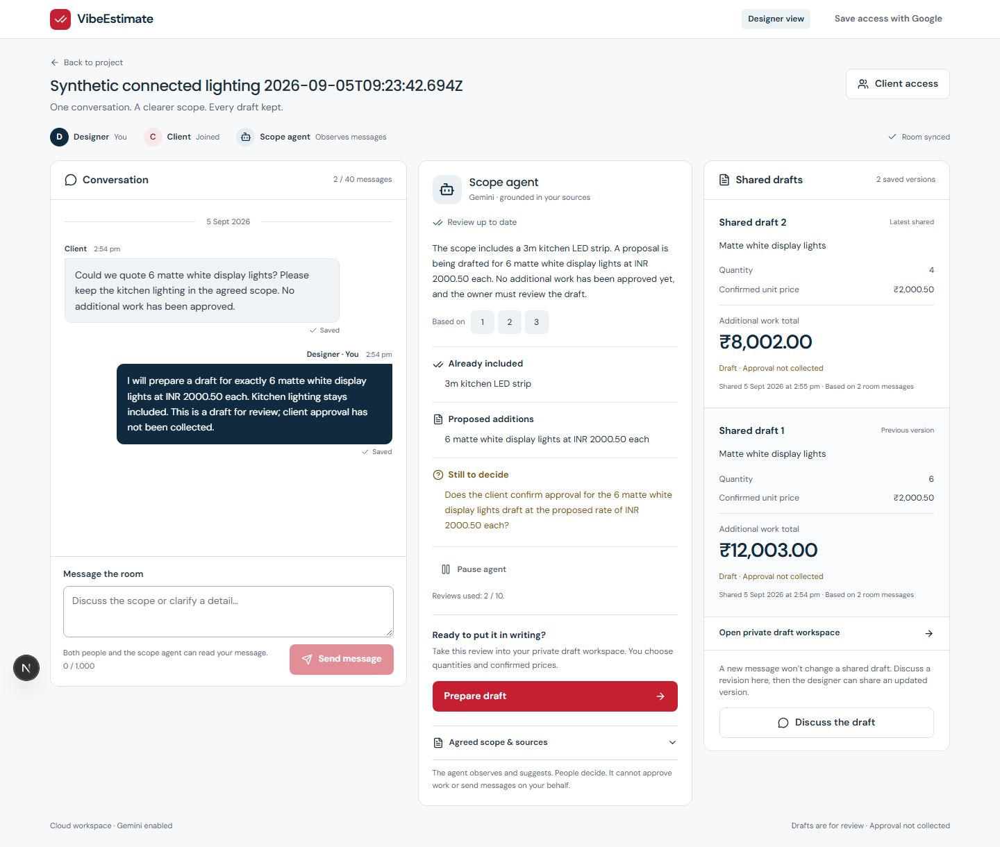
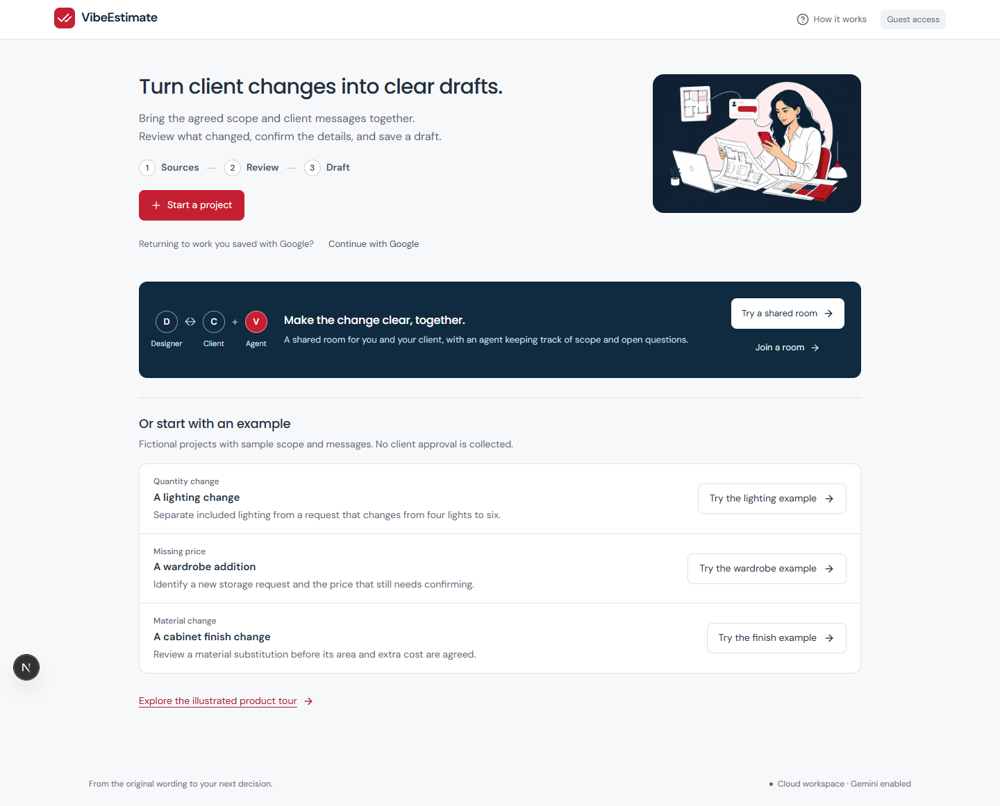

# VibeEstimate

Turn an agreed project scope and client messages into a reviewable change proposal. See what is included, clarify proposed additions, and revise a draft without losing its history.

This repository is the local foundation for a Google Cloud Gen AI Academy submission. The frontend uses the official Next.js setup and shadcn/ui. A TypeScript API verifies Firebase identities, isolates Firestore records, and calls the Google GenAI SDK when live mode is configured.

## Try locally

Requires Node.js 22.17+ and Java 21. All downloaded npm dependencies, emulator files, browser binaries, and MCP configuration stay in this project.

~~~sh
npm ci
npm run setup
npm run dev
~~~

Open **http://127.0.0.1:3000**. The API is at **http://127.0.0.1:8080/health**, and the Firebase emulator UI is at **http://127.0.0.1:4000**.

The home workspace explains Sources → Review → Draft. Choose **Start a project** for the two-step source form, or **Try the lighting example** to explore immediately. Saved projects show where to resume. The original navy/red landing page, illustrations and interactive product story remain at **http://127.0.0.1:3000/welcome**, linked from home.

For the complete collaborative demo, choose **Try a shared room**. In the room, choose **Invite client → Create invite link → Open client demo**. The new tab uses a separate client identity. Exchange messages between both tabs and watch the source-linked agent review update. The designer can prepare a private draft, return with **Back to room**, and **Share saved draft** so the client receives that saved version. Both interfaces run on port 3000 with the same authenticated API; no second server is needed.

The [client's separate view](docs/screenshots/connected-client-room.png) shows the same saved conversation and shared drafts with its own identity and permissions.

The initial connected version is preserved at `4fa4d70` on `snapshot/initial-connected-v1`. Work continues on `feat/spatial-home-studio` towards a spatial platform: a designer publishes an agent onto their own website, a homeowner talks to it, the agent opens a project and builds their home in 3D from an uploaded plan, and the designer reviews what it did through a visual console rather than a transcript.

That work is sequenced as three releases — read the [release plan](docs/plan/README.md), covering [v1](docs/plan/v1.md), [v2](docs/plan/v2.md), [v3](docs/plan/v3.md) and [who controls what](docs/plan/controls.md). The deep technical reference is the [researched implementation plan](docs/spatial-home-studio-plan.md) with its [UI brief](docs/spatial-studio-brief.md). Beyond the initial production release recorded in [production readiness](docs/production-readiness.md), no spatial or agent-crew feature is implemented yet.

The default runner uses a demo Firebase project and local Auth/Firestore emulators. Its AI provider is a clearly labeled, deterministic lighting fixture. It does not call paid Gemini services and does not access production Firebase data. Arbitrary scope analysis requires the real Gemini provider and server credentials.

For the separately authorized real Firebase workspace, follow [connected setup](docs/connected-setup.md) and open **http://localhost:3000**. Guests can start without a login form, join by QR/link/room code, and optionally link Google to keep access across devices. The existing database and auth providers are used unchanged; deployment remains deferred. A localhost QR supports this computer's demo and needs a reachable app address for another phone.

The sample demonstrates included kitchen lighting, a proposed display-light addition, a six-light draft at ₹12,000, and a four-light revision at ₹8,000. Amounts are fictional item subtotals. Client approval is not collected.

Follow the [demo walkthrough](docs/demo-walkthrough.md) for the complete story. For live Gemini with local Firebase emulators, use the private Vertex configuration in [local setup](docs/local-setup.md). The later connected and production journeys passed with real Firebase guests, Firestore and Gemini 3.7 Flash, including multi-turn reviews, draft creation, preserved revisions, explicit sharing, persistence and export. The [quick test checklist](docs/quick-test-checklist.md) covers the current routes and remaining limits. The [verification record](docs/verification.md) separates deployed-image results from source fixes; [build provenance and evidence](docs/ai-studio-evidence.md) identifies this repository as the authentic agent-assisted build history.

The illustrated product tour is preserved:

## Verify

~~~sh
npm run typecheck
npm test
npm run test:auth --workspace @vibeestimate/frontend
npm run build
npm run test:local
npm run mcp:verify
npm run check:public
~~~

The local test command starts the emulator/app stack when needed. If a stack is already running, it verifies local fixture mode before using it. Tests exercise real emulator identities and storage, access denial, checked arithmetic, revisions, replay behavior, browser interactions, and accessibility.

For a fresh fixture regression while the connected app is running, use `rtk npm run test:isolated`. It creates an isolated source copy on ports 3102/8180 with empty demo Firebase emulators, runs Rules and desktop/mobile browser checks, and stops only its own processes. Existing services on ports 3000/8080 and saved emulator snapshots remain available. All required isolated ports must be free. Reports stay under the ignored `.cache/fixture-verification/` directory.

Use `rtk npm run test:production -- --list` to inspect the production suite without model calls. Executing it requires the authorized external operator configuration; it uses real Firebase and a declared budget of six Gemini calls, with private evidence and no automatic retries. Fixture tests cannot be pointed at production.

See [verification status](docs/verification.md) for executed results and [local setup](docs/local-setup.md) for details. A test suite does not establish live-Gemini accuracy or production readiness.

## Project structure

| Path | Purpose |
| --- | --- |
| frontend/ | Official Next.js App Router and shadcn/ui interface; suitable for later Vercel deployment |
| backend/ | Express/TypeScript, Firebase Admin authorization/storage, Google GenAI adapter |
| infra/ | Terraform infrastructure and separate existing-Firebase adoption root |
| tests/ | Firebase Security Rules and Playwright tests |
| scripts/ | Project-local setup, process supervision, MCP, and verification |
| .agents/skills/impeccable/ | Vendored design skill with upstream provenance/license |
| PRODUCT.md / DESIGN.md | Durable product facts and UI design decisions |
| docs/ | Public setup, architecture, challenge, and infrastructure records |

## Before deployment

Deployment is deferred. Real account/project configuration and secrets belong outside the public checkout. Examples contain placeholders or demo identifiers.

The frontend and backend can use different cloud projects. Supply the actual Firebase web configuration to the frontend and the matching Firebase project to the backend. Backend CORS must allow the exact frontend origin. Terraform handles resource management and Cloud Run revisions; Cloud Build only builds/pushes the image.

Follow [Terraform setup](docs/terraform-setup.md), [infrastructure inventory](docs/infrastructure-inventory.md), and the [challenge checklist](docs/hackathon-checklist.md). Production journeys are verified; the checklist distinguishes remaining service confirmations and publication steps from completed repository build evidence.

The app has no WhatsApp integration, client signature collection, payment processing, or verified savings claims.
