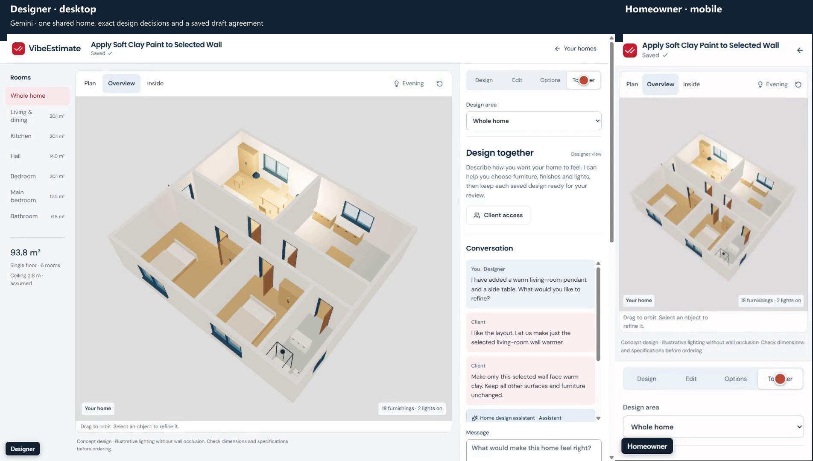
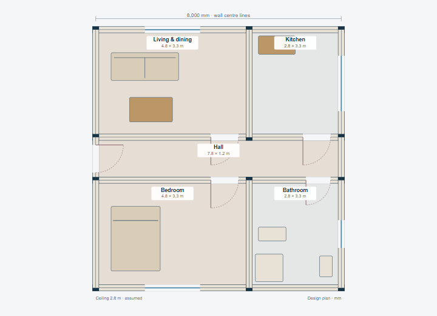
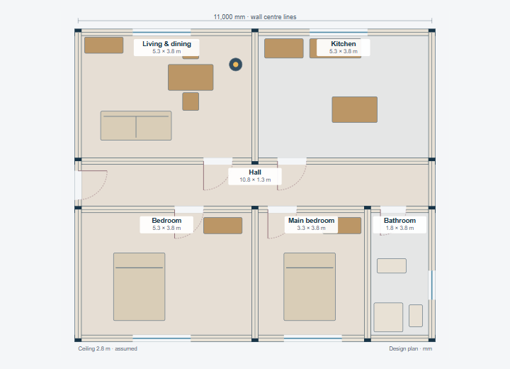
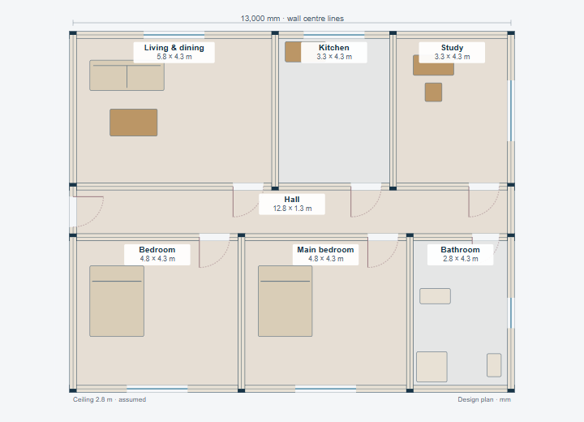
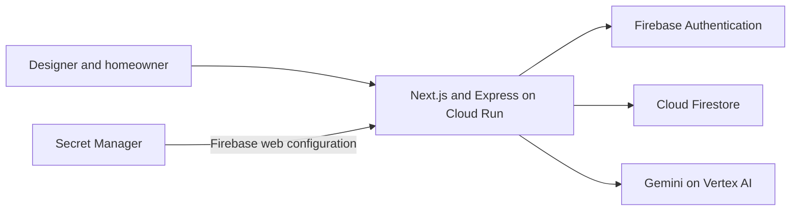

# VibeEstimate

**From a home idea to a shared design decision.**

Choose a complete home, describe what you want to change, and explore it in 2D and 3D. Gemini helps with furniture, lights and finishes. Invite your designer or homeowner, refine the same saved design through chat, and keep the reviewed changes in a downloadable draft agreement.

**[Try the live app →](https://vibe-estimate.xplormity.com)** · **[Watch the 2:56 walkthrough](https://vibe-estimate.xplormity.com/demo/index.html)** · [Verification](docs/v1-verification.md)

The live app is a single Cloud Run service in `asia-southeast1`. `vibe-estimate.xplormity.com` is a Cloud Run domain mapping onto that service, which also answers directly at [vibeestimate-tcevzp3fya-as.a.run.app](https://vibeestimate-tcevzp3fya-as.a.run.app).

[](https://vibe-estimate.xplormity.com/demo/index.html)

*Real Gemini, separate identities, visible clicks and synchronized desktop/mobile views. The silent recording includes chat, a selected wall change, both design decisions, matching agreement downloads and reopening. [Video file](frontend/public/demo/walkthrough.mp4) · [Recording provenance](docs/demo-media.md)*

## See it become a shared plan

| Start with an idea | Leave with something useful |
| --- | --- |
| **Choose a home.** Start with one of three measured, single-floor layouts. | A private project with a complete furnished home and Plan, Overview and Inside views. |
| **Describe the atmosphere.** Ask for warmer lights, a side table or softer finishes. | Gemini fills the design brief and proposes changes from the admitted asset catalog. |
| **Select precisely.** Pick a room, object, wall face or Plan region. | Validated changes stay within the chosen area; geometry, collisions and locks constrain the result. |
| **Keep a useful option.** Compare, undo, restore and reopen. | Immutable saved revisions, matching-camera comparison and exact-version exports. |
| **Design together.** A homeowner and designer join the same room with separate identities. | Shared geometry, attributed chat and explicit requests to a designer-configured assistant. |
| **Record the decision.** The homeowner accepts a version; the designer approves that same version. | A stored draft agreement both can download. Later edits require fresh decisions; older agreements remain available. |

### Three complete starting homes

| City apartment | Family home | Home with a study |
| :---: | :---: | :---: |
|  |  |  |

These previews come from the actual scene data. All three layouts use the same editor, sixteen locally authored catalog models and real wall openings. Dimensions are authored starting points; the 2.8m ceiling is disclosed as assumed. Lighting is illustrative, and agreements are drafts rather than legal signatures or permission to begin work.

## How the Google Cloud services fit together



| Service | What the application actually does |
| --- | --- |
| **Cloud Run** | Serves the frontend and API together from one container and one origin. Native Cloud Build and Terraform deploy a verified commit and immutable image. |
| **Firebase Authentication** | Establishes separate user identities. The API verifies ID tokens and derives ownership from the verified UID. Guest entry is supported, with optional Google account linking. |
| **Cloud Firestore** | Stores private projects, chat, immutable design revisions, explicit room membership and draft agreements. Every API operation checks owner or member access; direct browser database access is denied. |
| **Gemini** | Generates context-dependent design edits, briefs and agreement drafts through the server-side `@google/genai` SDK. Follow-up design requests use the saved scene and brief; proposal reviews retain multi-turn history. |
| **Secret Manager** | Injects a pinned Firebase browser-configuration version into Cloud Run. Gemini uses the attached Vertex runtime identity; this deployment does **not** demonstrate Gemini API-key retrieval from Secret Manager. |

The canonical JSON scene is authoritative. Zod validates model output; deterministic code enforces permitted operations, admitted assets, selection scope and geometry before publishing a revision. Pascal renders the result. Viewing, selecting, orbiting and downloading a saved agreement make no model calls.

See the [API contract](docs/v1-home-contract.md), [threats and controls](docs/plan/v1.md#threats-and-required-tests) and [submission service confirmations](docs/submission.md).

## Run locally

Use **Node.js 22.17+**, **Java 21** and a desktop capable of running a headed browser. Tooling, browsers, emulators and reports stay inside the checkout. These commands use the repository's RTK convention; developers without RTK can run the underlying `npm` commands directly.

```sh
rtk npm ci
rtk npm run setup
rtk npm run build
rtk npm run start:v1
```

Open **http://127.0.0.1:3100**. The isolated runner uses API `8181`, Auth emulator `9299` and Firestore emulator `8285`; it refuses occupied ports. Local mode uses an explicitly labelled deterministic AI fixture, with no paid calls or production data. Suggested prompts exercise the complete journey. Arbitrary model requests require the separately configured live provider.

<details>
<summary><strong>Use live Gemini with isolated local identities and storage</strong></summary>

```sh
rtk npm run start:v1 -- --gemini-config ../docs/private/vertex-local.json
```

Supply an existing, explicitly authorized private configuration outside the repository. Credentials stay server-side. Live failures remain visible and are never replaced with fixture results. [Local setup](docs/local-setup.md) · [Connected Firebase setup](docs/connected-setup.md)

</details>

## Deploy to Cloud Run

The production topology is one Cloud Run service, with separate frontend and backend code boundaries. Infrastructure is managed through Terraform; the repository contains no operator credentials or Terraform state.

1. **Configure your own targets privately.** Identify the Firebase project, backend project, regions and existing resources. Follow the [foundation setup](infra/production/README.md) and [Firebase adoption guide](docs/terraform-setup.md#firebase-adoption); import existing resources before managing them.
2. **Configure identity, storage and runtime access.** Enable the required APIs through Terraform, deploy the [Firestore rules](firestore.rules), authorize the application domain, and grant the runtime only its required Firebase, Vertex and Secret Manager permissions. The [deployment guide](docs/deployment.md#private-configuration) documents the exact configuration contract.
3. **Adopt native delivery.** Set up the Terraform-managed GitHub connection, build trigger and [runtime state](infra/runtime/README.md). Preserve `dev-tutorial=cloud-run-ai-challenge` on the service; the [runtime configuration](infra/runtime/main.tf) owns that campaign label.
4. **Verify and release.** Run the local checks below, review the task branch, then push the reviewed commit to `main`. [Cloud Build](cloudbuild.yaml) checks the source, builds and publishes the image, binds its digest, applies a restricted runtime plan and checks the deployed Git SHA.

```sh
rtk npm run verify:v1
rtk git push origin main
```

The push command is the release action **after the one-time Terraform setup**. Deployment success is checked against the exact source commit, image digest, serving revision and production health. [Complete deployment instructions](docs/deployment.md) · [Infrastructure inventory](docs/infrastructure-inventory.md)

## Tested beyond the JSON

Verification checks canonical data, actual Pascal mesh bounds/openings/materials, and real pointer/keyboard interactions. Browser evidence includes desktop, mobile, a narrow-screen Plan fallback, failures and accessibility checks.

| Executed evidence | Result |
| --- | --- |
| Complete headed Windows suite | **51/51 passed**, including all six flows, security and retained proposal regressions. |
| Linux shared-agreement recheck | **2/2 passed**, with both participant recordings preserved. The earlier Linux run's other fifty passing cases and retained failures are documented separately. |
| Live production rehearsal | **2/2 passed**; three actual Gemini jobs, three reserved attempts, no test retries. |
| Source and release checks | Typechecks, lint, frontend/backend tests, scene tests, Firestore Rules, production build and deployment provenance passed. |

[Read the complete verification record](docs/v1-verification.md) for exact tested commits, limitations and retained failure evidence. Reproduce the complete local gate with `rtk npm run verify:v1`; the headed browser reports and videos are written under `.cache/v1/`.

## Explore the code

| Path | Responsibility |
| --- | --- |
| [frontend/](frontend/) | Next.js, shadcn/ui, home studio, shared room and public walkthrough |
| [backend/](backend/) | Verified identity, access control, persistence, bounded Gemini jobs and money calculations |
| [packages/scene-schema/](packages/scene-schema/) | Strict scene, patch, selection and catalog contracts |
| [packages/scene-core/](packages/scene-core/) | Geometry, permitted edits and deterministic change descriptions |
| [packages/pascal-adapter/](packages/pascal-adapter/) | Pascal rendering, native selection and actual-geometry inspection |
| [infra/](infra/) | Terraform foundations and native delivery |
| [tests/](tests/) | Security, geometry, browser journeys and recording verification |

The existing source-linked scope/pricing workflow remains available at `/proposals`. Image-to-layout extraction, multiple floors and the wider agent-service crew are later scope. [Product context](PRODUCT.md) · [Design system](DESIGN.md) · [V1 plan](docs/plan/v1.md) · [Authentic build history](docs/ai-studio-evidence.md)
