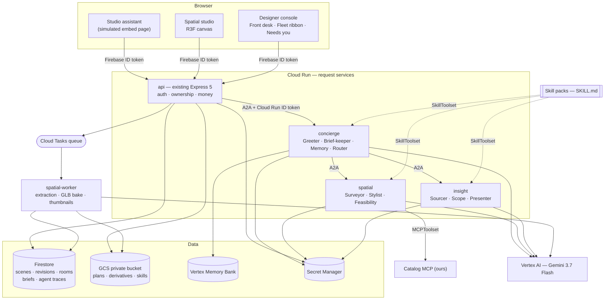
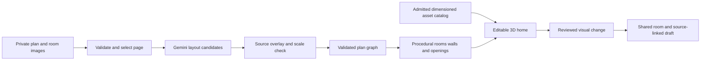

# v2 — The crew

**Goal: win the ideathon.**

This release maps onto the four judging pillars directly. **Authenticity** — a designer-embeddable spatial agent crew. **Usability** — the 3D home, the Living Brief, the change cards. **Stability** — deployed, bounded, honest failure states. **Security** — context projection, per-service IAM, tenant isolation, untrusted-data rules.

It is also the risky release, because most of the new surface lands here. The [cut line](#the-cut-line) is the mitigation and is meant to be used.

Related: [release map](README.md) · [v1](v1.md) · [controls](controls.md) · [technical reference](../spatial-home-studio-plan.md)

---

## The demonstration

A clearly synthetic full apartment — living/dining, kitchen, two bedrooms, two bathrooms, balcony. The agreed scope includes kitchen lighting and excludes additional display lighting.

1. A homeowner lands on a page that plays the role of the designer's website and opens the studio assistant. They upload their plan and say what they want.
2. **Greeter** opens a project and a room. **Brief-keeper** begins filling a visible requirement card as they talk. **Surveyor** reads the plan in the worker pool and asks about one uncertain door opening. The homeowner confirms a known living-room dimension and corrects the door.
3. **The Reveal** — the checked plan extrudes into the whole home.
4. The homeowner selects the living-room display wall and asks for six matte-white display lights. **Stylist** selects admitted catalog assets and proposes six placements linked to that wall and that request. **Feasibility** confirms clearances.
5. A change card says *Six display lights proposed*. **Scope** links the exclusion in the agreed scope and asks for the missing rate. It does not turn a catalog illustration into a product quotation.
6. The designer opens the console. The Front Desk shows this conversation as a tile with a thumbnail of the home the crew built. *Needs you* holds one card: six lights, scope excludes display lighting, rate missing.
7. The designer compares at the same camera, adopts four lights, enters a confirmed rate, saves and shares the draft. The previous scene and proposal remain accessible.
8. Both sessions reopen after a restart. The change card still opens the correct historical scene.

This is the journey to build, not a record of one already executed.

---

## The crew

Nine roles, three services, one worker pool. Plain role names, matching the brand's plain-language commitment.

| Role | Job | Service |
| --- | --- | --- |
| **Greeter** | The embedded assistant. Multi-turn, multimodal. Opens the project, holds the conversation, knows when to escalate to a human. | `concierge` |
| **Brief-keeper** | Maintains the structured requirement record — rooms, budget band, must-keeps, constraints, timeline — as a live document the homeowner sees and corrects. | `concierge` |
| **Memory** | Cross-session preference memory via Vertex Agent Engine Memory Bank. The homeowner's taste; the designer's house style and rate card. | `concierge` |
| **Surveyor** | Plan image to wall, opening and room graph. Gemini bounding boxes and segmentation — coordinates normalised to 0–1000, structured as `box_2d` + `mask` + `label` — then deterministic geometry validation and calibration questions. | `spatial` |
| **Stylist** | Typed scene-edit tools: place admitted assets, apply admitted materials, move, rotate and resize within declared bounds. Previews only. | `spatial` |
| **Feasibility** | Deterministic clearance and circulation checks — door swing, walkway width, mounting surface, collision. Routes any wall or opening change to the designer instead of applying it. | `spatial` |
| **Sourcer** | Google Search grounding for real product options and price ranges. Always cites. Never writes a price into an estimate. | `insight` |
| **Scope** | Today's observer, upgraded: source-linked findings, included versus additional, missing decisions, quantities from admitted instances, integer-paise arithmetic. | `insight` |
| **Presenter** | Turns a change set into visual artifacts — matched before and after, change cards, a one-page brief. What the designer reads instead of a transcript. | `insight` |

A **Router** in `concierge` decomposes each turn and dispatches. It is an ADK `LlmAgent` with `spatial` and `insight` attached as remote A2A agents.

Named for [v3](v3.md#more-roles), not built here: Translator/Tone, Photo-reader, Follow-up.

---

## What the crew carries — Skills and MCP

**Skills are how a designer teaches the crew. MCP is how the crew reaches the outside world.**

### Skills

ADK's `SkillToolset` loads SKILL.md directories with three-level progressive disclosure — L1 metadata (roughly 100 tokens per skill, always loaded), L2 the body (loaded only when the agent judges it relevant), L3 files under `references/` (loaded only when the instructions reach for them) — auto-generating `list_skills`, `load_skill` and `load_skill_resource`. This repository already vendors a skill in exactly that shape at `.agents/skills/impeccable/`.

| Skill | Loaded by | Carries |
| --- | --- | --- |
| `plan-reading` | Surveyor | Residential plan conventions — symbols, dimension notation, typical wall thicknesses, how to find a scale bar, what a hatch means. |
| `room-standards` | Feasibility, Stylist | Door swing, walkway width, kitchen work triangle, bathroom clearances, mounting heights. The deterministic checks live in code; the skill carries the reasoning and citations. |
| `scope-review` | Scope | Included versus additional work, what makes a decision missing, how to phrase a clarification. Today's `SYSTEM_INSTRUCTION` promoted into a maintainable document. |
| `estimate-math` | Scope | Quantity rules per unit type, the rounding policy, what may never be assumed. |
| `presenting-changes` | Presenter | How to compose a change card, what a before and after must show, what may never be claimed. |
| **`designer-voice`** *(per tenant)* | Greeter, Presenter | Written from that designer's own approved messages and rate card, in their private namespace. |
| `skill-creator` | Console | Lets a designer author or edit a skill from the console. ADK ships one. |

**`designer-voice` is the designer's own agent made safe.** The Greeter writes in the designer's voice because it is reading a *document* they can open, edit, version and revoke — not an opaque fine-tune. Every draft still passes through *Needs you*. The folder lives in the private bucket, loads at task start, and its content hash goes into the `AgentTrace`.

The token economics are what make nine roles affordable: seven skills cost roughly 700 tokens of baseline context, and a body loads only when it is actually relevant.

### MCP

Consumed via `MCPToolset(connectionParams, toolFilter?, prefix?)`. In v2 there is one: **Catalog MCP**, ours, used by the Stylist.

Exposing the admitted asset catalog as an MCP server rather than a plain function tool makes it a swappable, versioned service — so a designer can later point at their own vendor catalog, and a furniture vendor can publish one we consume. That is the ecosystem hook. Rate-card, Maps and third-party vendor servers are [v3](v3.md#more-mcp).

### Rules for both

Every toolset is allowlisted per agent via `toolFilter`. No MCP server holds write access to scene, storage, pricing or sharing. **MCP responses and skill bodies are untrusted data under exactly the same rule as uploaded sources** — never instructions, and a product returned by any server cannot become a price without designer confirmation. A tenant's skill folder is scoped to that tenant and hashed, so it is provable which document shaped a given reply.

---

## Architecture

**Why the split.** `concierge` is chatty and latency-sensitive. `spatial` is token- and CPU-heavy per call on a completely different scaling curve. `insight` is bursty and mostly idle. Splitting means one homeowner's plan extraction cannot starve another homeowner's conversation, and each service gets its own service account, model budget and scaling floor. The existing `api` keeps what must never move: token verification, ownership, money, and the Firestore write path.

**This split is for scaling and blast radius, not for identity.** Two identities in one browser already work through named Firebase apps in `frontend/src/lib/firebase.ts`, and the existing plan is right that a second server is unnecessary for that.

**Long jobs extend the delivery path that [v1](v1.md#deploy-what-already-works) already deployed** — the Cloud Tasks review queue and its authenticated recovery scheduler, with the observer running inside managed task requests in `backend/src/room-tasks.ts`. Do not introduce a parallel Pub/Sub mechanism for the same shape of work. A pull-based Cloud Run worker pool is the right answer only if a specific job justifies it — long-lived instances, GPU, or work that genuinely does not fit a request — and that justification is recorded before the resource is created.

**Auth between services.** Per-service service accounts. `roles/run.invoker` granted only along edges that actually exist. The caller mints an ID token from the metadata server with the callee's URL as audience. No `allUsers` on `concierge`, `spatial` or `insight`. The **end user's** verified Firebase UID travels separately inside the A2A task metadata, never as ambient trust — so every hop knows both which human started this and which agent is acting. Discovery through A2A Agent Cards at `/.well-known/a2a`.

---

## Context — projected, not replicated

The answer to "independently scaling but with the right context" is that **context is never copied — it is projected**.

There is one canonical store. `packages/context-kit` assembles a typed **Context Bundle** for each agent task, scoped to `(actor, room, sceneRevision, purpose)`:

- **Surveyor** gets the plan image, page transform and calibration state. Not the rate card, not the conversation.
- **Stylist** gets the current selection, room geometry, the admitted catalog subset and the brief. Not the plan pixels, not prices.
- **Sourcer** gets the brief and the selected object's dimensions. Not the plan, not the client's identity.
- **Scope** gets the frozen scope text, the change set and the evidence index. Not the catalog.

Every bundle is content-hashed and recorded. This is simultaneously a security control — no cross-tenant leakage, minimal prompt-injection surface — a cost control, since prompts stay small, and a demo asset, because the console can show the exact bundle each agent received.

**`AgentTrace`** records the role, the A2A task ID and state, the bundle hash and summary, the skill and MCP tools used, the operations proposed, what a human did with it, and tokens with estimated cost. One record powers the Fleet Ribbon, debugging, the cost view, and a provable answer to "did agent X ever see tenant Y's data".

---

## From source to editable 3D

1. **Accept** PNG, JPEG and a selected PDF page. Proposed limits: 4 MiB per image, 10 MiB per PDF, five pages available for selection, one page processed per floor, 20 megapixels decoded per image, and a bounded parser timeout. Reject encrypted or malformed PDFs and unsupported CAD, SVG and archive formats with a useful explanation. Verify actual support before the upload copy claims it.
2. **Preserve** the private original and its hash. Generate a sanitized preview and a bounded model image, recording page, crop, rotation and image-to-plan transforms. Strip unnecessary metadata from derivatives. Room photos and inspiration images carry explicit roles and room associations.
3. **Propose.** Gemini returns line segments, openings, room labels, dimension text and source regions. Missing or contradictory values become questions. A model confidence number is not a measured accuracy score and is never presented as one.
4. **Calibrate** two selected points against a known real measurement. A second check can expose scan distortion. A distorted photograph may need corner correction or manual tracing — one distance cannot correct all perspective distortion.
5. **Keep an unscaled concept view** available for orientation and material exploration, visibly approximate, with source geometry in image coordinates and a provisional display transform. Dimensioned furniture placement waits for calibration.
6. **Validate** the floor graph with the pure validators from [v1](v1.md#scene-foundation).
7. **Build** floors, wall segments, real openings, jambs and lintels deterministically.
8. **Manual tracing and correction stay in the same workflow.** If recognition fails, the upload and any successful geometry are retained so the user finishes rather than restarting.

A floor plan does not establish existing furniture, exact finishes, ceiling form, services or structural adequacy. Room photographs can inform visible existing items and materials with source references; users confirm consequential dimensions. An inferred sofa must never appear as an evidenced existing item.

Ask during source preparation whether the source depicts the current home, a planned design or an unknown state. Use **Existing** only for explicitly evidenced existing conditions — a checked plan, an inferred finish or a prior proposal is not automatically a record of what physically exists.

---

## Model tools

| Tool | Allowed result |
| --- | --- |
| `get_scene_context` | Authorized current selection, revision, relevant geometry and source references. Bounded response. |
| `search_assets` | Admitted IDs and dimensions filtered by room, category and style. No arbitrary URL fetching. |
| `measure_selection` | Deterministic geometry measurements with calibration status. |
| `propose_scene_change` | Typed operations referencing a base revision, admitted IDs and existing entities. A preview only. |
| `request_clarification` | A bounded question linked to an uncertain room, object or source. |

Operations: place a catalog instance, move or rotate an object, apply an admitted material, change a permitted parametric size, remove a selected object. Layout corrections use a separate permitted wall and opening operation group that routes to the designer.

**Never exposed to any model:** generated JavaScript, arbitrary Three.js object graphs, storage paths, external tool destinations, price-setting, sharing.

**Bounded limits.** At most two model rounds per explicit edit, four tool reads per round, eight operations per preview, twelve object instances in a group. An unresolved request ends with a question rather than an autonomous tool loop. The UI displays the actual proposed operations; **Apply** creates a version using the same authorization, validation and geometry checks as a manual edit.

The server validates visual and AI operations identically. A model suggestion stays a preview until the user chooses Apply; ordinary direct edits follow the same validator, save path and undo history.

---

## Interface — the signature moves

Mode is **Operate**, per [spatial-studio-brief.md](../spatial-studio-brief.md). The incumbent visual system is preserved throughout.

1. **The Living Brief.** The homeowner's screen is not a transcript. Left: their home, filling in as they talk. Right: a requirement card that **visibly writes itself** — room chips light up, a budget band appears, *must keep: the balcony* pins itself. Every item is editable, strikeable and draggable. The conversation *is* the act of filling in a document you can watch. A text input exists but is not the protagonist.
2. **The Reveal.** When the plan passes its scale check, the 2D plan **extrudes** into the whole home — walls rise, openings punch through, rooms name themselves. Once, on a real state change, never as a loading performance. Gated in JavaScript for reduced motion.
3. **Ghost and Solid.** Comparison is not a slider. The baseline stays as a translucent ghost inside the same view while the option renders solid, at one matched camera, with the baseline always named — *Starting layout · v1*, *Shared version 3*.
4. **The Change Card — the atom.** Matched before and after, affected objects, factual change list, source link, exact revision, camera, open questions. Cards **travel**: into the conversation, into the designer's queue, into a proposal's evidence, into the export. Clicking one anywhere opens the home at that camera and revision. This is what "visual, not text" means mechanically.
5. **The Front Desk.** The console home: a wall of tiles, one per live conversation — a rendered thumbnail of the home the crew built, the client, a one-line want, and a state of new, talking, needs you, or waiting on client. An inbox of homes, not of messages.
6. **The Fleet Ribbon.** Lanes per agent role showing what each is doing right now and on which project. Click a lane item to see the exact Context Bundle it received and the operations it proposed. The crew becomes something you can *watch* — a trust feature and a debugging tool as much as a demo asset.
7. **Needs you.** The human-in-the-loop queue. Every item is a card: *Priya's kitchen — crew proposes six display lights. Scope excludes display lighting. Rate missing.* Approve, Edit or Ask. Nothing goes outward without the designer.
8. **The Handoff.** When a designer takes over, the homeowner is told plainly that a person joined. The crew never impersonates the designer.

Receiving a comment or a scene event must not steal focus. Cameras and selections are private by default.

---

## Data, sharing and collaboration

| Entity | Notes |
| --- | --- |
| `PlanAsset` | Owner and project, original hash, role, MIME, size, pages, derivative hashes, private storage generation. |
| `PlanCandidate` | Source page and transform, pixel geometry, recognized labels, questions, assumptions. Never the confirmed scene head. |
| `Brief` | The Living Brief: rooms, budget band, must-keeps, constraints, timeline — each field with a source of stated, inferred or confirmed, plus provenance. |
| `EditProposal` | Actor, base revision, typed operations, validation result, assumptions and questions, apply status. |
| `SharedSceneSnapshot` | Explicit room audience, frozen revision and manifest, approved asset references, optional source attachments. |
| `ClientOption` | Client-owned fork of a shared snapshot, private edit history, explicit submission record. No pointer granting access to the designer's private scene. |
| `Annotation` | Shared snapshot, entity or room anchor, optional point and camera, message and attachment IDs. |
| `SpatialJob` | Owner, kind, input hash, base revision, status, attempt budget, lease, cancellation, result or error metadata. |
| `AgentTrace` | Role, task, bundle hash, skill and MCP tools used, proposals, human outcome, cost. |

**Sharing is a projection, not a serialization.** Create an allowlisted shared projection rather than serializing the private revision: omit owner identifiers, unshared source excerpts, private file and provenance references, and storage paths. Include only the geometry, descriptive properties, admitted asset dependencies and attachments explicitly granted to that snapshot. **Recheck the grant on every asset and source retrieval.**

Scene sharing is separate from sharing the original plan, reference photographs or private scope documents. The share dialog previews the audience and the selected attachments.

**Client options.** A client sees only the frozen scene and assets explicitly shared to that room, plus their own options. Client reference photos upload into the client's option namespace, never the designer's project. **The designer cannot retrieve unsubmitted attachments;** submission creates explicit grants for only the selected attachment versions and derivatives. Client options permit furniture and material changes; a requested wall or opening change is sent for designer review rather than changing the checked layout. An object annotation remains anchored to its historical snapshot if the object is later removed.

**Local recovery.** Pending operations are retained in a size-bounded IndexedDB outbox partitioned by verified UID and scene, so an account change cannot reveal another identity's edits. Raw private originals and server credentials are never cached there. Report when local recovery storage is unavailable.

### Endpoints

| Endpoint | Boundary |
| --- | --- |
| `POST /api/projects/:id/plans` and authorized asset retrieval | Owner upload and read; shared-source retrieval follows an explicit snapshot grant. |
| `POST /api/client/options/:id/attachments` and authorized retrieval | Client-option owner uploads and reads bounded PNG/JPEG references; the designer reads only explicitly submitted versions. |
| `POST /api/projects/:id/spatial-jobs`, `GET /api/spatial-jobs/:id` | Owner-only extraction and status, with deduplication and budgets. |
| `POST /api/scenes/:id/edit-proposals` | Authorized actor interprets a request against an owned scene or a private client option. |
| `POST /api/scenes/:id/revisions` | Validated manual and applied edits with the optimistic revision check. |
| `POST /api/rooms/:id/share-scene` | Designer explicitly publishes a saved scene and chosen attachments. |
| `GET /api/rooms/:id/scenes/:snapshotId` | Room member reads exactly the shared manifest. |
| `POST /api/rooms/:id/options` and option submission | Client creates a private fork; submission exposes an immutable option to the designer. |
| `POST /api/rooms/:id/annotations` | Member posts a message tied to accessible visual evidence. |
| `GET /api/client/rooms`, `POST /api/rooms/:id/read-cursor` | Memberships for the verified identity with pagination; that identity's last actually-viewed event sequence. |

These become shared schemas in `packages/scene-schema` before parallel implementation begins.

---

## Jobs, budgets and honest failure

Persist stages `uploaded`, `reading`, `needs-check`, `ready`, `failed`, `cancelled`, `outcome-unknown`. Show actual stage transitions instead of a fake countdown.

**Reserve a persisted attempt before calling Gemini.** Make the call outside Firestore transactions. Persist the result and validate the base revision before publishing. Duplicate delivery or a reload reuses a completed result. A crash after dispatch with no stored response becomes **outcome-unknown**, with an explicit retry choice that may incur another request. **Do not promise exactly-once provider billing.** Cancellation stops future work and prevents stale publication; an already dispatched request may still complete.

Share the existing observer's concurrency and budgeting controls in `backend/src/room-store.ts`. Proposed defaults: one active spatial job per owner, one extraction attempt plus one explicit retry per source revision, bounded two-round edits. Request replay is scoped to verified actor, authorized target and request ID; reusing an ID with different canonical input is rejected. **Attempt budgets persist independently of request IDs.**

**Extraction caching is scoped to owner, source revision and hash, transform, and model and prompt version**, so another tenant cannot infer a private upload through a cache hit.

Private client options receive a bounded allocation within the parent room's shared model budget plus a client sublimit; creating another option or request ID cannot reset it. Private option content is never disclosed to the designer through budget bookkeeping.

**No paid request is made merely to view, save, export or orbit the scene.** The connected verification run declares its model-call budget before execution.

The observer reacts to submitted messages and deliberately submitted change sets — Share or Request review — after a quiet period. It does not run on ordinary autosaves, drags, selections, viewport moves or private client experiments.

---

## Build order

1. **Plan to 3D.** Private GCS bucket via Terraform — uniform access, public-access prevention, explicit retention and lifecycle, narrowly scoped object permissions. Upload, page preparation, Surveyor extraction on the queue, calibration and correction, **The Reveal**, manual tracing fallback. **Re-run the dependency review here**: [dependency-review.md](../dependency-review.md) currently defers the `uuid` advisory on the grounds that the application does not call object storage, with an explicit instruction to reassess if storage or UUID call sites change. Adding the bucket fires that condition.
2. **The crew deployed.** `concierge`, `spatial`, `insight` and `spatial-worker`; A2A cards; IAM ID tokens; Context Bundles; `AgentTrace`; the five shared skill packs; Catalog MCP.
3. **Stylist and Feasibility.** Typed tools with preview and apply, collision feedback, bounded rounds, change cards, Ghost and Solid.
4. **Two-person visual workflow.** Allowlisted shared snapshots, private client options with their own attachment namespace, anchored discussion, explicit send and adopt.
5. **Designer console.** Front Desk, Fleet Ribbon, *Needs you*, honest handoff, `designer-voice` authored through `skill-creator`, and the designer controls in [controls](controls.md#the-designer) — autonomy per action class, pricing authority, intake qualification, budget caps, handoff triggers.
6. **Living Brief** on the homeowner side.
7. **Simulated embed page** — a hosted page that plays the role of the designer's website and carries the assistant. The demo's opening shot. `next.config.ts` sets `X-Frame-Options: DENY`; v2 hosts the page itself rather than weakening that. The real cross-origin SDK is [v3](v3.md#real-embed-sdk).
8. **Deploy all four runtimes**, record the demo, publish the `#AccelerateAIwithCloudRun` post.

The Client desk must not claim to be connected to Slack or email. No automatic outreach is part of the observer.

---

## The cut line

If time runs short, cut from the bottom. Each item below the line is separable and none breaks the demo's spine.

**Must ship:** deployed crew · plan to 3D with The Reveal · Stylist previews with change cards · Front Desk and *Needs you* · the simulated embed page.

**Should ship:** Fleet Ribbon · Living Brief · two-person client options · Feasibility.

**First to cut:** `designer-voice` and `skill-creator` · Sourcer grounding · Memory Bank.

---

## What carries forward

From [docs/spatial-home-studio-plan.md](../spatial-home-studio-plan.md): job states including `outcome-unknown`; attempt reserved before the model call; the typed tool table; bounded round and operation limits; tenant-scoped extraction caching; the allowlisted shared projection; the client option namespace; the IndexedDB outbox; manual tracing as the recognition fallback; and a subset of the annotated plan benchmark. The full distribution is in [v1](v1.md#what-carries-forward-from-the-existing-plan).

---

## v2 gate

The deployed end-to-end journey against the public URL, in two real browser sessions with independent identities.

**Security.** Cross-tenant bundle isolation. Skill-body and MCP-response injection both rejected. Unknown asset IDs, forged owner roles, arbitrary paths and URLs, and price and sharing commands all refused. Unauthenticated, stranger and client-role denial on every new route; guessed IDs; revoked accounts; cross-room references; direct object retrieval; private client photos; filtered provenance; presentation of unpublished scenes. **The [access matrix](controls.md#access-matrix) is enforced cell by cell**, and the [designer defaults](controls.md#the-designer) hold for a designer who never opens settings — the crew cannot share, cannot set a price, and cannot read an unsubmitted client attachment.

**Files.** Spoofed MIME, double extension, malformed and encrypted PDFs, oversized and decompression inputs, interrupted upload.

**Geometry.** Known dimensions, crop and rotation transforms, distorted scans, missing openings, non-finite values, intersecting polygons.

**Concurrency and money.** Simultaneous edits, stale job return, rebase with removed entities, two independent browsers. Duplicate dispatch, changed-payload replay, new IDs and options exhausting the same budget, worker crash, cancellation, stale publication. Storage succeeds while Firestore fails; save timeout; interrupted export; restart; orphan cleanup that does not delete referenced blobs.

**Product truth.** Included item, missing price, quantity changes, rounding, old-draft compatibility, client action denial. An un-approved proposal cannot reach the homeowner; a client option cannot alter the checked layout.

**Interface.** Keyboard-only and non-drag touch editing, 320px layout, screen-reader names, WebGL context loss, missing assets, console at 390px.

**Measured, not asserted.** Performance on a *named* phone, with device, browser, frame-time percentiles, transferred bytes and GPU-memory proxies recorded. The benchmark subset published including its failures. Headless Playwright proves interactions, not representative phone GPU performance.

Snapshot `snapshot/v2-crew`.
