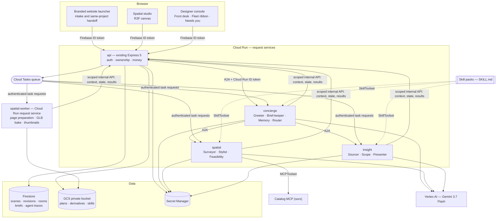
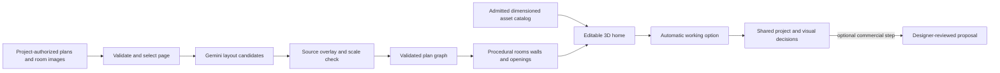

# v2 — The crew

**Goal: a complete autonomous single-floor product, from the designer's website to a saved, editable home and optional human review.**

This release maps onto the four judging pillars directly. **Authenticity** — a designer-embeddable spatial agent crew. **Usability** — the 3D home, the Living Brief, the change cards. **Stability** — deployed, bounded, honest failure states. **Security** — context projection, per-service IAM, tenant isolation, untrusted-data rules.

Deliver it in verified increments. The [cut line](#the-cut-line) separates presentation extras from the required product journey; a reduced competition demo is not a completed v2.

Related: [release map](README.md) · [v1](v1.md) · [controls](controls.md) · [technical reference](../spatial-home-studio-plan.md)

---

## The demonstration

A clearly synthetic full apartment — living/dining, kitchen, two bedrooms, two bathrooms, balcony. The agreed scope includes kitchen lighting and excludes additional display lighting.

1. A homeowner opens the branded launcher on the designer's website. Entry explains that project activity is shared with this studio. Their first substantive input starts intake; the full studio opens in a dedicated tab with the same project.
2. **Greeter** continues in the studio-owned project and room. **Brief-keeper** fills a visible requirement card. **Surveyor** reads the uploaded plan through the queued workflow and asks about one uncertain door opening. The homeowner confirms a known living-room dimension and corrects the door.
3. **The Reveal** — the checked plan extrudes into the whole home.
4. The homeowner selects the living-room display wall, attaches a reference image and asks for six matte-white display lights. **Stylist** selects admitted assets and automatically saves six validated placements to a working option. **Feasibility** checks clearances; compare and undo are immediately available.
5. A change card says *Six display lights proposed*. **Scope** links the exclusion in the agreed scope and asks for the missing rate. It does not turn a catalog illustration into a product quotation.
6. The designer opens the console. The Front Desk shows this conversation as a tile with a thumbnail of the home the crew built. *Needs you* holds one card: six lights, scope excludes display lighting, rate missing.
7. The homeowner compares options and chooses four lights without waiting for a designer. If a commercial proposal is wanted, the designer plays the visual briefing, confirms the rate, saves and explicitly shares the formal draft. Earlier scene and proposal versions remain accessible.
8. Both sessions reopen after a restart. The change card still opens the correct historical scene.

This is the journey to build, not a record of one already executed.

## Platform contracts

- **Studio and agent profile.** Add `Studio`, project membership and immutable `AgentProfileVersion` records. A designer configures identity, services, approved knowledge/style and action controls, previews, then publishes a version and installs its launcher. A public embed key identifies that published configuration; it grants no project access. Shared agent services serve all studios, with per-studio budgets and task context.
- **Guest intake and ownership.** The API verifies Firebase identity and resolves the published studio before idempotently creating the project, room and homeowner membership on the first substantive input. New client-facing content is shared with those project members by default. A homeowner's rights come from a project grant, not possession of the designer's UID. Professional notes remain private; no migration broadens legacy project, source or option grants.
- **Images and audience.** Plan, existing-room photo and inspiration are explicit source roles. The selected entity, permitted image versions and brief accompany image-based edits. Upload bytes use a bounded object-upload grant; the 48 KiB JSON gateway limit is not raised globally. Every retrieval, derivative, trace and export rechecks the source audience. Tasks reading professional notes cannot publish client-facing artifacts.
- **Visual state.** Extend `Brief` with anchored requirements and stated/inferred/confirmed provenance plus pending/met/conflict status backed by checks. `Keep this` locks an entity or material slot; only an authorized human unlocks it. `Decision` records selected/rejected option revisions and reasons. A typed `UIArtifact` registry covers source checks, option comparisons, requirements, change cards and briefing stops; tools return data and admitted IDs, never executable UI.
- **Autonomous edits.** `propose_scene_change` returns a validated patch; the API automatically commits allowed patches to a working option under the default policy. The chosen result is preserved; later agent work forks a new option. User locks, base revision, current grants, budgets and the takeover generation are rechecked at commit. `Use this option` records a preference, never commercial approval.
- **Preferences.** Save and update project preferences automatically with provenance and edit/forget controls. Cross-project reuse needs the homeowner's opt-in within the same studio. Firestore remains authoritative; any Memory Bank projection carries source versions and is invalidated on edit, deletion or revoked consent. Designer style comes from the published profile, not another client's history.

These are v2 additions to the existing ownership layer. [Controls](controls.md) owns action permissions and audience rules; the following sections own runtime behavior and release gates.

---

## The crew

Nine roles, three shared agent services and one request-driven media worker. Roles scale independently by workload group, not by creating a service for each designer.

| Role | Job | Service |
| --- | --- | --- |
| **Greeter** | The embedded assistant. Multi-turn, multimodal. Opens the project, holds the conversation, knows when to escalate to a human. | `concierge` |
| **Brief-keeper** | Maintains the structured requirement record — rooms, budget band, must-keeps, constraints, timeline — as a live document the homeowner sees and corrects. | `concierge` |
| **Memory** | Automatically maintains project preferences; optional same-studio recall follows consent and source versions. Designer style comes from the published profile. | `concierge` |
| **Surveyor** | Plan image to wall, opening and room graph. Gemini bounding boxes and segmentation — coordinates normalised to 0–1000, structured as `box_2d` + `mask` + `label` — then deterministic geometry validation and calibration questions. | `spatial` |
| **Stylist** | Uses selected entities and authorized reference images to place assets, apply materials, move, rotate and resize. Validated edits save automatically to working options with undo and locks. | `spatial` |
| **Feasibility** | Deterministic clearance and circulation checks — door swing, walkway width, mounting surface, collision. Proposed alterations to the checked layout require designer review; initial source calibration follows the source-check flow. | `spatial` |
| **Sourcer** | Google Search grounding for real product options; client-facing price ranges only when pricing policy permits. Always cites. Never commits a rate to an estimate. | `insight` |
| **Scope** | Today's observer, upgraded: source-linked findings, included versus additional, missing decisions, quantities from admitted instances, integer-paise arithmetic. | `insight` |
| **Presenter** | Turns a change set into visual artifacts — matched before and after, change cards, a one-page brief. What the designer reads instead of a transcript. | `insight` |

A **Router** in `concierge` decomposes each turn and dispatches. It is an ADK `LlmAgent` with `spatial` and `insight` attached as remote A2A agents.

Named for [v3](v3.md#more-roles), not separate roles here: Translator/Tone, specialist Photo-reader, Follow-up. Surveyor and Stylist already support native images in v2.

---

## What the crew carries — Skills and MCP

**Skills are how a designer teaches the crew. MCP is how the crew reaches the outside world.**

### Skills

ADK's `SkillToolset` loads SKILL.md directories with three-level progressive disclosure — L1 metadata (roughly 100 tokens per skill, always loaded), L2 the body (loaded only when the agent judges it relevant), L3 files under `references/` (loaded only when the instructions reach for them) — auto-generating `list_skills`, `load_skill` and `load_skill_resource`. This repository already vendors a skill in exactly that shape at `.agents/skills/impeccable/`.

| Skill | Loaded by | Carries |
| --- | --- | --- |
| `plan-reading` | Surveyor | Residential plan conventions — symbols, dimension notation, typical wall thicknesses, how to find a scale bar, what a hatch means. |
| `room-standards` | Feasibility, Stylist | Door swing, walkway width, kitchen work triangle, bathroom clearances, mounting heights. The deterministic checks live in code; the skill carries the reasoning and citations. |
| `scope-review` | Scope | Included versus additional work, what makes a decision missing, how to phrase a clarification. Today's `SYSTEM_INSTRUCTION` promoted into a maintainable document. |
| `estimate-math` | Scope | Quantity rules per unit type, the rounding policy, what may never be assumed. |
| `presenting-changes` | Presenter | How to compose a change card, what a before and after must show, what may never be claimed. |
| **`designer-voice`** *(per tenant)* | Greeter, Presenter | Published voice/style guidance derived from approved examples. Private notes and raw rate cards are excluded; pricing access follows its separate permission. |
| `skill-creator` | Console | Lets a designer author or edit a skill from the console. ADK ships one. |

**`designer-voice` is editable, versioned and revocable.** Greeter uses the published guidance for automatic replies labelled as the assistant. Only blocked or consequential actions enter *Needs you*. The folder lives in the private bucket, loads at task start, and its content hash goes into the `AgentTrace`.

Progressive disclosure limits baseline context; measure actual tokens and total workflow cost before claiming that the nine-role system is affordable.

### MCP

Consumed via `MCPToolset(connectionParams, toolFilter?, prefix?)`. In v2 there is one: **Catalog MCP**, ours, used by the Stylist.

Exposing the admitted asset catalog as an MCP server rather than a plain function tool makes it a swappable, versioned service — so a designer can later point at their own vendor catalog, and a furniture vendor can publish one we consume. That is the ecosystem hook. Rate-card, Maps and third-party vendor servers are [v3](v3.md#more-mcp).

### Rules for both

Every toolset is allowlisted per agent via `toolFilter`. Catalog MCP holds no scene or commercial write access. Uploaded sources and MCP responses are untrusted evidence; published skills supply bounded task guidance and cannot override permissions, locks or budgets. Scene mutations go through the API's typed validator. A tenant's skill folder is scoped and hashed; a catalog price never becomes a committed rate without human confirmation.

---

## Architecture

**Why the split.** `concierge` is chatty and latency-sensitive. `spatial` is token- and CPU-heavy per call on a completely different scaling curve. `insight` is bursty and mostly idle. Splitting means one homeowner's plan extraction cannot starve another homeowner's conversation, and each service gets its own service account, model budget and scaling floor. The existing `api` keeps what must never move: token verification, ownership, money, and the Firestore write path.

The worker writes immutable media derivatives to its granted GCS locations and returns results through the API; it cannot publish a scene head directly. Internal API routes verify the calling service's ID token and delegated run grant even though the browser API is publicly reachable. A2A hops carry the same run identity and reserved budget.

**This split is for scaling and blast radius, not for identity.** Two identities in one browser already work through named Firebase apps in `frontend/src/lib/firebase.ts`, and the existing plan is right that a second server is unnecessary for that.

**Long jobs extend the delivery path that [v1](v1.md#verification-videos-and-release) already deployed** — the Cloud Tasks review queue and its authenticated recovery scheduler, with the observer running inside managed task requests in `backend/src/room-tasks.ts`. Do not introduce a parallel Pub/Sub mechanism for the same shape of work. A pull-based Cloud Run worker pool is the right answer only if a specific job justifies it — long-lived instances, GPU, or work that genuinely does not fit a request — and that justification is recorded before the resource is created.

**Auth between services.** Per-service service accounts. `roles/run.invoker` granted only along actual edges, including the task dispatcher; ID-token audiences match the callee URL. No `allUsers` on agent or media services. A2A metadata identifies the actor and delegated task grant, which receivers verify against API-owned state; a caller-supplied UID is not authorization. Use the Agent Card route supported by the SDK combination verified during implementation.

---

## Context — projected, not replicated

The answer to "independently scaling but with the right context" is that **context is never copied — it is projected**.

There is one canonical store. `packages/context-kit` assembles a typed **Context Bundle** for each task, scoped to `(studio, project, actor, room, sceneRevision, briefVersion, profileVersion, runId, purpose)`, with source grants, allowed tools, remaining budget and takeover generation:

- **Surveyor** gets the plan image, page transform and calibration state. Not the rate card, not the conversation.
- **Stylist** gets the current selection, room geometry, authorized existing/inspiration images, locks, the admitted catalog subset and the brief. No unrelated images or private prices.
- **Sourcer** gets the brief and the selected object's dimensions. Not the plan, not the client's identity.
- **Scope** gets the frozen scope text, the change set and the evidence index. Not the catalog.

Every bundle is content-hashed and recorded with its source grants. Hashes support audit; authorization and projection enforce isolation. The console shows only fields and source versions that its viewer may read, including for derived summaries.

**`AgentTrace`** records the role, the A2A task ID and state, the bundle hash and summary, the skill and MCP tools used, the operations proposed, what a human did with it, and tokens with estimated cost. One record powers the Fleet Ribbon, debugging, the cost view, and a provable answer to "did agent X ever see tenant Y's data".

Persist ADK session state, A2A task state, attempts and artifacts through API-backed adapters; instance memory is never the only copy. Record a run and dispatch intent transactionally, then enqueue Cloud Tasks; the existing recovery scheduler repairs missed dispatches. Agent and media retries reuse persisted results and obey the [job rules](#jobs-budgets-and-honest-failure). The API exposes an authenticated event stream with sequence IDs and replay after reconnect, rechecking membership; camera motion never triggers a model. Independent read/research tasks may run in parallel within the budget, while scene commits serialize through revision checks.

---

## From source to editable 3D

1. **Accept** PNG, JPEG and a selected PDF page. Proposed limits: 4 MiB per image, 10 MiB per PDF, five pages available for selection, one page processed per floor, 20 megapixels decoded per image, and a bounded parser timeout. Reject encrypted or malformed PDFs and unsupported CAD, SVG and archive formats with a useful explanation. Verify actual support before the upload copy claims it.
2. **Preserve** the private original and its hash. Generate a sanitized preview and a bounded model image, recording page, crop, rotation and image-to-plan transforms. Strip unnecessary metadata from derivatives. Room photos and inspiration images carry explicit roles and room associations.
3. **Propose.** Gemini returns line segments, openings, room labels, dimension text and source regions. Missing or contradictory values become questions. A model confidence number is not a measured accuracy score and is never presented as one.
4. **Calibrate** two selected points against a known real measurement. A second check can expose scan distortion. A distorted photograph may need corner correction or manual tracing — one distance cannot correct all perspective distortion.
5. **Keep an unscaled concept view** available for orientation and material exploration, visibly approximate, with source geometry in image coordinates and a provisional display transform. Dimensioned furniture placement waits for calibration.
6. **Validate** the floor graph with the pure validators from [v1](v1.md#scene-catalog-and-gemini).
7. **Build** floors, wall segments, real openings, jambs and lintels deterministically.
8. **Manual tracing and correction stay in the same workflow.** If recognition fails, the upload and any successful geometry are retained so the user finishes rather than restarting.

A floor plan does not establish existing furniture, exact finishes, ceiling form, services or structural adequacy. Room photographs can inform visible existing items and materials with source references; users confirm consequential dimensions. An inferred sofa must never appear as an evidenced existing item.

Ask during source preparation whether the source depicts the current home, a planned design or an unknown state. Use **Existing** only for explicitly evidenced existing conditions — a checked plan, an inferred finish or a prior proposal is not automatically a record of what physically exists.

---

## Model tools

| Tool | Allowed result |
| --- | --- |
| `get_scene_context` | Authorized current selection, revision, relevant geometry and source references. Bounded response. |
| `search_assets` | Admitted IDs and dimensions filtered by room, category and style. No arbitrary URL fetching. |
| `measure_selection` | Deterministic geometry measurements with calibration status. |
| `propose_scene_change` | Typed operations against a base revision and admitted IDs; the API commits permitted edits automatically to a working option, or holds them when an explicit review policy applies. |
| `update_brief`, `remember_preference` | Source-linked project updates; cannot expand memory scope or remove human locks. |
| `present_artifact` | An admitted `UIArtifact` with authorized source/revision references; no generated executable UI. |
| `request_clarification` | A bounded question linked to an uncertain room, object or source. |

Operations: place a catalog instance, move or rotate an object, apply an admitted material, change a permitted parametric size, remove a selected object. Initial calibration/correction uses the source-check flow; later alterations to checked walls and openings use a separate operation group requiring designer review.

**Never exposed to any model:** generated JavaScript, arbitrary Three.js object graphs, storage paths, arbitrary external tool destinations, price commitments or audience-expansion tools.

**Bounded limits.** At most two model rounds per edit task, four tool reads per round, eight operations per patch and twelve object instances in a group. The router completes authorized steps automatically within the persisted run budget; creating subtasks cannot reset it. Ask only when missing information blocks progress. The UI shows committed changes, compare and undo; human review is limited to the action classes in [controls](controls.md).

The server validates visual and AI operations identically. Allowed AI changes save to a working option automatically; ordinary direct edits use the same validator and undo history. A rejected patch preserves the last valid option. Use this option chooses a result without implying a commercial approval.

---

## Interface — the signature moves

Mode is **Operate**, per [spatial-studio-brief.md](../spatial-studio-brief.md). The incumbent visual system is preserved throughout.

1. **The Living Brief.** The homeowner's screen is not a transcript. Left: their home, filling in as they talk. Right: a requirement card that **visibly writes itself** — room chips light up, a budget band appears, *must keep: the balcony* pins itself. Every item is editable, strikeable and draggable. The conversation *is* the act of filling in a document you can watch. A text input exists but is not the protagonist.
2. **The Reveal.** When the plan passes its scale check, the 2D plan **extrudes** into the whole home — walls rise, openings punch through, rooms name themselves. Once, on a real state change, never as a loading performance. Gated in JavaScript for reduced motion.
3. **Ghost and Solid.** Comparison is not a slider. The baseline stays as a translucent ghost inside the same view while the option renders solid, at one matched camera, with the baseline always named — *Starting layout · v1*, *Shared version 3*.
4. **The Change Card — the atom.** Matched before and after, affected objects, factual change list, source link, exact revision, camera, open questions. Cards **travel**: into the conversation, into the designer's queue, into a proposal's evidence, into the export. Clicking one anywhere opens the home at that camera and revision. This is what "visual, not text" means mechanically.
5. **The Front Desk.** The console home: a wall of tiles, one per live conversation — a rendered thumbnail of the home the crew built, the client, a one-line want, and a state of new, talking, needs you, or waiting on client. An inbox of homes, not of messages.
6. **The Fleet Ribbon.** Lanes show actual task progress and results. Details expose an audience-filtered Context Bundle and operations; private notes, source grants and derived private content never leak through tracing.
7. **Needs you.** Exceptions and consequential decisions appear as visual cards, such as *Display lights — rate missing*. Routine replies, research, reversible edits and draft preparation run automatically. Confirming and sharing formal commercial proposals remains a designer action.
8. **The Handoff.** The assistant is always labelled. Actual takeover increments a server-side generation and pauses public replies and scene commits; in-flight results from the old generation cannot publish. Authorized private analysis may continue within the same budget. **Resume assistant** explicitly starts fresh work against current revisions and permissions; old results are not flushed into the project.
9. **Play briefing and decisions.** The designer can play saved views showing requirements, selected/rejected options, reasons and unresolved decisions. Keep this is visible on locked objects/materials, and constraint failures open at their actual scene anchors.

Receiving a comment or a scene event must not steal focus. Cameras and selections are private by default.

---

## Data, sharing and collaboration

| Entity | Notes |
| --- | --- |
| `Studio`, `AgentProfileVersion`, `ProjectMembership` | Published studio configuration, immutable profile versions and verified actor grants. |
| `PlanAsset` | Studio, project, uploader, audience, original hash, role, MIME, size, pages, derivative hashes, private storage generation. |
| `PlanCandidate` | Source page and transform, pixel geometry, recognized labels, questions, assumptions. Never the confirmed scene head. |
| `Brief` | The Living Brief: rooms, budget band, must-keeps, constraints, timeline — each field with a source of stated, inferred or confirmed, plus provenance. |
| `EditProposal` | Actor, base revision, typed operations, validation result, assumptions and questions, commit status and automatic/human origin. |
| `SharedSceneSnapshot` | Explicit room audience, frozen revision and manifest, approved asset references, optional source attachments. |
| `ClientOption` | New project's shared working option: creator, base revision, immutable history and chosen/rejected state. Legacy private options retain their grants. |
| `Annotation` | Authorized scene revision, entity or room anchor, optional point and camera, message and attachment IDs. |
| `SpatialJob` | Owner, kind, input hash, base revision, status, attempt budget, lease, cancellation, result or error metadata. |
| `AgentRun`, `Decision`, `UIArtifact` | Durable task/session identity, budget and takeover generation; selected/rejected revisions and reasons; typed visual output with source audiences. |
| `AgentTrace` | Role, task, bundle hash, skill and MCP tools used, proposals, human outcome, cost. |

**Sharing is a projection, not a serialization.** Create an allowlisted shared projection rather than serializing the private revision: omit owner identifiers, unshared source excerpts, private file and provenance references, and storage paths. Include only the geometry, descriptive properties, admitted asset dependencies and attachments explicitly granted to that snapshot. **Recheck the grant on every asset and source retrieval.**

New-project membership covers client-facing messages, plans, reference images, working options and decisions, disclosed on entry. It never grants professional notes or existing private records. Expanding the audience or sharing a formal proposal remains an explicit human action with an audience preview.

**Client options.** In new studio projects, members can see working options and their authorized reference images as they develop. Agents automatically save validated furniture/material edits; compare, undo and Use this option preserve user control. A requested wall or opening alteration routes to designer review rather than changing the checked layout. An annotation remains anchored to its historical revision if the object is later removed. Legacy private scenes, options and attachments keep explicit grants; no new private-scratchpad feature is added in v2.

**Local recovery.** Pending operations are retained in a size-bounded IndexedDB outbox partitioned by verified UID and scene, so an account change cannot reveal another identity's edits. Raw private originals and server credentials are never cached there. Report when local recovery storage is unavailable.

### Endpoints

| Endpoint | Boundary |
| --- | --- |
| `POST /api/studios`, `POST /api/studios/:id/agent-profiles`, `POST /api/studios/:id/publish` | Verified designer creates the studio, previews configuration and publishes an immutable profile version; never accepts caller-selected ownership. |
| `GET /api/embeds/:key`, `POST /api/intakes` | Public published configuration only; authenticated guest input idempotently creates the studio project and grants membership. |
| `POST /api/intakes/:id/handoff`, `POST /api/intakes/redeem` | Mint and atomically redeem a short-lived, single-use project handoff; bind the destination and verified guest, never expose Firebase tokens to the parent page. |
| `POST /api/projects/:id/plans` and authorized asset retrieval | Project upload grant for the homeowner/designer; bounded direct object upload and source-audience checks. |
| `POST /api/client/options/:id/attachments` and authorized retrieval | Permitted editor uploads bounded PNG/JPEG references; reads follow project/source grants, including legacy restrictions. |
| `POST /api/projects/:id/spatial-jobs`, `GET /api/spatial-jobs/:id` | Project-authorized extraction and status, with deduplication and canonical studio budgets. |
| `POST /api/scenes/:id/edit-proposals` | Task-authorized request against a working option; permitted patches commit automatically under current policy. |
| `POST /api/scenes/:id/revisions` | Validated manual and applied edits with the optimistic revision check. |
| `POST /api/rooms/:id/share-scene` | Designer explicitly grants a saved scene/attachments to an additional room audience; ordinary shared-project edits do not call this. |
| `GET /api/rooms/:id/scenes/:snapshotId` | Room member reads exactly the shared manifest. |
| `POST /api/rooms/:id/options` and option selection | Authorized member creates a shared working option; selection records an immutable decision. Legacy submission grants remain supported. |
| `POST /api/rooms/:id/annotations` | Member posts a message tied to accessible visual evidence. |
| `GET /api/client/rooms`, `POST /api/rooms/:id/read-cursor` | Memberships for the verified identity with pagination; that identity's last actually-viewed event sequence. |
| `POST /api/projects/:id/assistant-control`, `GET /api/projects/:id/events` | Designer takeover/resume updates the generation; members receive audience-filtered progress with sequence replay. |
| `PATCH /api/projects/:id/preferences`, `DELETE /api/projects/:id/preferences/:key` | Authorized edit/forget; only the homeowner can opt into cross-project recall. Derived memory is invalidated. |
| `POST /api/projects/:id/exports`, `GET /api/exports/:id` | Export only actor-authorized scene, sources and proposal content; no automatic external delivery. |

These become shared schemas in `packages/scene-schema` before parallel implementation begins.

---

## Jobs, budgets and honest failure

Persist stages `uploaded`, `reading`, `needs-check`, `ready`, `failed`, `cancelled`, `outcome-unknown`. Show actual stage transitions instead of a fake countdown.

**Reserve a persisted attempt before calling Gemini.** Make the call outside Firestore transactions. Persist the result and validate the base revision before publishing. Duplicate delivery or a reload reuses a completed result. A crash after dispatch with no stored response becomes **outcome-unknown**, with an explicit retry choice that may incur another request. **Do not promise exactly-once provider billing.** Cancellation stops future work and prevents stale publication; an already dispatched request may still complete.

Share the existing observer's concurrency and budgeting controls in `backend/src/room-store.ts`. Proposed defaults: one active spatial job per owner, one extraction attempt plus one explicit retry per source revision, bounded two-round edits. Request replay is scoped to verified actor, authorized target and request ID; reusing an ID with different canonical input is rejected. **Attempt budgets persist independently of request IDs.**

**Extraction caching is scoped to owner, source revision and hash, transform, and model and prompt version**, so another tenant cannot infer a private upload through a cache hit.

Working options receive a bounded allocation within the canonical studio/project model budget plus a client sublimit; a new guest, option, subtask or request ID cannot reset it. Budget bookkeeping never discloses legacy private content or professional notes.

**No paid request is made merely to view, save, export or orbit the scene.** The connected verification run declares its model-call budget before execution.

The observer reacts to user messages and completed change sets after a quiet period, once per revision/purpose. Automatic option commits may schedule one scope/constraint review. Ordinary autosaves, drags, selections, viewport moves and the observer's own progress events do not create model-call loops.

---

## Complete-product capabilities

**Real website intake.** Ship a lightweight launcher in an isolated iframe, branded through the published studio profile, then open the full studio in a dedicated tab. Restrict widget embedding with per-studio CSP `frame-ancestors`; adjust `X-Frame-Options` only for that route. The embed key is a public identifier, never a credential. Validate message origin/source. A short-lived, single-use handoff binds studio, project and destination; redemption verifies the destination Firebase identity and grants only that project's guest access. No Firebase token reaches the parent page. A hosted intake link remains available when storage or popups are blocked. The simulated designer website exercises this same flow locally.

**Walkthrough and briefing.** Required: collision-aware room stops, previous/next, saved viewpoints, reset/exit and a show-what-changed path using historical change cards. Play briefing combines those stops with requirements, decisions and open questions. Touch and keyboard navigation work without pointer lock, with reduced-motion alternatives. Free movement and live Present/Follow remain v3 extensions.

**Spatial exports.** Required: editable project JSON, derived GLB, and a plan/image with a change sheet and any authorized proposal. Export from the canonical revision, not the cutaway viewport. GLB contains scene geometry/materials only, with no messages, notes or source files. Other outputs enforce source grants; clients receive only client-facing content and explicitly shared proposals. Validate/reload GLB independently. JSON restore validates schema/assets, creates an actor-authorized project and never trusts imported owners, storage paths or grants. Exports are deterministic and trigger no model call.

**Evaluation.** Complete the 12-plan annotated benchmark before calling v2 complete: clean homes, rotated/cropped plans, poor scans and ambiguous/unscaled inputs, including held-out plans. Record room/connectivity accuracy, wall/opening error against annotated tolerances, missing entities, correction actions/time, calls and latency. Publish failures and automatic versus corrected results separately. Clean corrected plans must match the annotated graph and tolerance; unresolved critical issues cannot be labelled checked. Test a new visitor completing intake, calibration, image-based editing, option selection and walkthrough without coaching, plus a designer opening the visual briefing.

---

## Build order

1. **Platform and contracts.** Studio/profile setup, preview/publish, guest project creation, project grants, shared defaults, Living Brief and preference records. Agree shared schemas before implementation.
2. **Durable crew runtime.** Implement the three agent services and media request service, typed context/session/task adapters, dispatch recovery, replayed progress, skills and Catalog MCP. Prepare Terraform for private service/queue/bucket IAM and hosted domains; these are v2 prerequisites.
3. **Plan to 3D and native images.** Bounded uploads, media preparation, Surveyor extraction, calibration/correction, The Reveal and manual tracing. Re-run [dependency review](../dependency-review.md) when object storage is added, as that review requires.
4. **Autonomous visual work.** Stylist, Feasibility and Sourcer; image-and-selection edits; automatic working-option commits, locks, comparison, undo, decisions and source-linked scope review.
5. **Designer console.** Front Desk, Needs you, published voice/style configuration, visual briefing, takeover/resume and [designer controls](controls.md#the-designer). The assistant must complete ordinary homeowner work while no designer is online.
6. **Website and collaboration.** Real launcher/intake, same-project studio handoff and shared visual discussion. The simulated website and Client desk exercise real independent identities locally.
7. **Complete-product gates.** Walkthroughs, canonical exports, 12-plan evaluation, device/accessibility checks and all permission/failure cases.
8. **Production verification.** Deploy the existing API changes and four new runtimes with target-specific authorization through Terraform; verify the complete public journey and record evidence. Prepare any competition demo/post as a draft; publishing requires separate explicit authorization.

The Client desk must not claim to be connected to Slack or email. No automatic outreach is part of the observer.

---

## The cut line

Deliver the must-ship journey incrementally. A shorter demo can show a verified subset, but must not be labelled the complete product.

**Must ship:** studio/profile setup and real website intake · shared project and native images · full-floor 3D · autonomous options, locks and decisions · Living Brief · Feasibility and grounded research · project preferences · Front Desk, Play briefing and takeover · walkthroughs · spatial exports · durable runtime and the complete evaluation gates.

**Should ship:** richer Fleet Ribbon visualization and daily digests. Basic progress, trace access controls and actual task status are required.

**First to cut:** the advanced `skill-creator` authoring UI and optional Memory Bank adapter. Basic published profile editing and project preference persistence remain required.

---

## What carries forward

From [docs/spatial-home-studio-plan.md](../spatial-home-studio-plan.md): durable job/attempt rules; bounded typed tools; scoped caches and projections; local recovery; manual tracing; room-stop walkthroughs; canonical exports; and the full 12-plan benchmark. Older sharing and Apply policies are replaced by [controls](controls.md). The distribution is recorded in [v1](v1.md#scope-boundaries).

---

## v2 gate

The deployed end-to-end journey against the public URL, in two real browser sessions with independent identities.

**Security.** Cross-studio/project isolation; skill/MCP injection cannot override policy. Reject forged roles, unknown assets, arbitrary paths/URLs, price commitments and audience expansion. Test permitted homeowner uploads/edits as well as unauthenticated/stranger denial, guessed IDs, revoked grants, private professional notes, legacy attachments and derived trace/memory leakage. Enforce every cell of the [access matrix](controls.md#access-matrix).

**Files.** Spoofed MIME, double extension, malformed and encrypted PDFs, oversized and decompression inputs, interrupted upload.

**Geometry.** Known dimensions, crop and rotation transforms, distorted scans, missing openings, non-finite values, intersecting polygons.

**Concurrency and money.** Simultaneous edits, stale job return, rebase with removed entities, two independent browsers. Duplicate dispatch, changed-payload replay, new IDs and options exhausting the same budget, worker crash, cancellation, stale publication. Storage succeeds while Firestore fails; save timeout; interrupted export; restart; orphan cleanup that does not delete referenced blobs.

**Product truth.** Included item, missing price, quantity changes, rounding and old-draft compatibility. A formal commercial proposal needs designer review and explicit sharing; routine assistant replies and working options do not. Options cannot alter checked architecture or human locks. Selection never implies client approval.

**Interface.** Keyboard-only and non-drag touch editing, 320px layout, screen-reader names, WebGL context loss, missing assets, console at 390px.

**Complete journey.** Publish the branded agent; use a real cross-origin launcher; preserve the guest project across handoff, expiry/replay tests and blocked-storage/popup fallback. Upload a permitted reference image and edit its selected object automatically without Apply. Compare, undo and choose; verify anchored requirements and decision history. Reconnect after task/session restart, take over during a run, reject stale publication and explicitly resume. Test memory edit/forget/consent, walkthrough navigation and canonical export/restore.

**Measured, not asserted.** Performance on a *named* phone, with device, browser, frame-time percentiles, transferred bytes and GPU-memory proxies recorded. Publish the full benchmark including failures and correction effort. Headless Playwright proves interactions, not representative phone GPU performance.

Snapshot `snapshot/v2-crew`.
