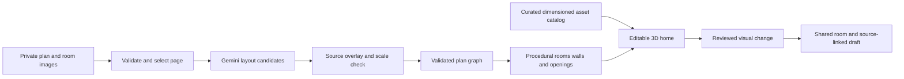

# VibeEstimate spatial home studio

**Reference status:** geometry, storage and validation detail below remains useful. Product behavior and release scope follow [docs/plan](plan/README.md), particularly [controls](plan/controls.md) and [platform contracts](plan/v2.backup.md#platform-contracts). Older private-option, preview/Apply, sharing and seven-stage delivery assumptions below are superseded. This historical planning checkpoint is not a current implementation or deployment status report.

Planning checkpoint: 5 September 2026. This document specifies the next version before implementation. [Primary-source research](spatial-research.md) and [the surface brief](spatial-studio-brief.md) support it. Application code and cloud resources are unchanged by this checkpoint.

> **Delivery sequencing has moved.** This document remains the deep technical reference for geometry, units, storage, threats and evaluation, and its findings are unchanged. Only its seven-stage delivery sequence is superseded, by the three releases in [the release plan](plan/README.md) — [v1](plan/v1.md), [v2](plan/v2.md), [v3](plan/v3.md) and [who controls what](plan/controls.md). [v1 records which finding lands in which release](plan/v1.md#scope-boundaries).

## Preserved initial version

The working connected version is committed at **4fa4d70** and preserved on **snapshot/initial-connected-v1**. Its original task branch is **feat/connected-firebase-rooms**. The new planning/build branch is **feat/spatial-home-studio**.

The initial feature baseline includes guided source review, live Gemini 3.7 Flash, real Firebase guest identities, independent designer/client rooms, QR/code invitations, saved draft revisions, explicit sharing and export. Executed checks remain in [verification.md](verification.md). Personal Google consent, genuine AI Studio evidence and deployment remain outstanding; the snapshot does not claim a deployed release.

## Product direction

**Upload a home plan. Explore the home in 3D. Try changes together and turn the chosen changes into a clear draft.**

The home is the main workspace. People act on rooms, walls, materials and furniture. A conversation can refer to the exact place and version. The designer can trace a visual change back to the plan, a client's request and the agreed scope before preparing commercial terms.

The signature interaction is a **visual change card**: matched before/after views, affected objects and a factual change list. Selecting the card opens that location in the home. The same card can travel into the shared discussion and a draft's evidence without implying a price or approval.

Planning assumptions, awaiting any user correction: the first complete journey covers one entire single-floor home; homeowners try private options and send them to the designer. Multi-storey homes are explicitly included in the later sequence. The data model starts with levels so the first floor does not become a dead end.

## The complete user journey

| Step | What the user sees and does | Result they can rely on |
| --- | --- | --- |
| Start | Compact home with **Upload a plan**, **Try a complete home**, recent work and **Join a room**. Existing source-only projects and the illustrated tour remain accessible. | The purpose is understandable without reading a chat transcript or signing in. |
| Prepare source | See the uploaded plan, choose a PDF page, rotate/crop it and identify the floor. Add room photos or inspiration images as separate references. | The original file is retained. The app distinguishes a plan from a perspective photo. |
| Check layout | Inspect a wall/door/room overlay on the original. Confirm one known distance and its unit; correct highlighted uncertain items by clicking or numeric entry. | A reviewable layout with explicit scale, assumptions and unresolved issues. |
| Enter the home | The checked plan becomes a complete cutaway home. Room names and **Choose a room to try an idea** guide the next action. | Every supported room remains navigable; the original plan is one action away. |
| Try an idea | Click the living-room wall or choose an item from the catalog. Change a material, place furniture, move/rotate it, or attach a reference photo. **Ask for a change** uses the current selection. | A visible, reversible preview with known object identities and dimensions. |
| Compare | Toggle the named Starting layout/Option or compare both at the same camera. Save views and walk from room to room. | The user can see what changed and what stayed in place. |
| Discuss | **Discuss this** pins the object, room and scene version to a real message. Invite the other person by existing QR/link/code. | Both independent identities discuss the same saved visual evidence. |
| Send an option | The homeowner sends a frozen option; the designer reviews individual changes and adopts selected ones into a new revision. | Private experiments remain private until sent. Existing shared versions remain intact. |
| Prepare the draft | The observer identifies scope references and missing decisions. The designer supplies confirmed quantities/rates and explicitly shares a saved draft. | Deterministic money, original evidence, revisions, approval status and export continue to work. |

Progress is the completed work: plan saved, layout checked, first idea saved, option shared, draft saved. Use these actual milestones and a useful next action. Do not add invented progress percentages, streaks or engagement rewards.

## A concrete demonstration

Use a clearly synthetic full apartment containing living/dining, kitchen, two bedrooms, two bathrooms and a balcony. The agreed scope includes kitchen lighting and excludes additional display lighting.

1. Upload its plan; confirm a known living-room dimension. Correct an intentionally uncertain door opening in the overlay, then reveal the entire home.
2. Select the living-room display wall and choose **Add lighting**. Ask for six matte-white display lights. Gemini selects admitted catalog assets and proposes six visible placements, linked to that wall and request.
3. A visual change card says **Six display lights proposed**. The scope agent links the exclusion and asks for the missing rate. It does not convert a catalog illustration into a product quotation.
4. Open the separate homeowner view. Walk into the living room, try four lights in a private option, and attach a reference photo with **Use a warmer finish**. Send the option to the designer.
5. The designer compares the same angle, adopts four lights, enters a confirmed rate, and saves/shares the draft. The previous scene and proposal remain accessible.
6. Reopen both sessions after restart. Export the saved scene, plan view and proposal. The change card still opens the correct historical scene.

This is the first end-to-end demonstration to build, not a fabricated record of an executed spatial journey.

## Interface and interaction

Preserve the existing navy/red palette, self-hosted fonts, 56px header, original imagery and `/welcome`. The studio expands the brand into a working canvas with natural material colours. It does not restyle the rest of the app.

```text
 VibeEstimate / Apartment     Saved · Option 2       Undo  Redo    Share
 ----------------------------------------------------------------------
 Rooms          Overview  Inside  Plan     Starting layout / Option
 Whole home     +----------------------------------+  Living-room wall
 Living room    |                                  |  Material / Add
 Kitchen        |        EDITABLE HOME             |  Selected change
 Bedroom 1      |    click a room, wall or object   |  Source / Details
 Bedroom 2      |                                  |  Discuss this
 ...            +----------------------------------+  Apply / Discard
 Checks (1)     Whole home · Living · Kitchen · + Save view
                Changes (2)                       Discussion
```

The right inspector appears when useful. Catalog, properties and discussion reuse that region rather than filling the screen simultaneously. The layout is a visual change-review surface: a full canvas by default, with matched-angle comparison or linked 2D/3D available on demand. The brief defines mobile and accessible alternatives.

Comparison always names its baseline, such as **Starting layout · v1** or **Shared version 3**. Store that exact revision in the option and change card. Ask whether the source depicts the current home, a planned design or an unknown state during source preparation. Use **Existing** only for explicitly evidenced existing conditions; a checked plan, inferred finish or prior proposal is not automatically a record of what physically exists. A changed comparison baseline is an explicit user action.

Editing uses direct selection, tap-to-place, drag handles and numeric controls. Show a translucent placement preview and collisions before applying it. A model suggestion stays a preview until the user chooses **Apply**; ordinary direct edits follow the same validator, save path and undo history. Wall changes require the plan view and an explicit layout revision so moving a sofa cannot accidentally alter architecture.

**Overview** uses an orthographic cutaway. **Inside** enters at a chosen room with a visible exit/reset control. **Plan** supplies the source overlay and precision editing. The walkthrough offers room stops, previous/next, saved viewpoints and optional free movement. Do not make pointer lock or a game-style keyboard scheme the only way to inspect the home. Camera position, cutaway and daylight mood are viewing preferences; changing them does not change geometry or trigger the model.

## From source to editable 3D



1. Accept PNG/JPEG and a selected PDF page initially. Proposed limits: 4 MiB per image, 10 MiB per PDF, five pages available for selection, one page processed per floor, 20 megapixels decoded per image and a bounded parser timeout. Reject encrypted/malformed PDFs and unsupported CAD/SVG/archives with a useful explanation. Actual support is verified before showing it in upload copy.
2. Preserve the private original and its hash. Generate a sanitized preview and a bounded model image, recording page, crop, rotation and image-to-plan transforms. Strip unnecessary metadata from derivatives. Room photos and inspiration images have explicit roles and room associations.
3. Gemini proposes line segments, openings, room labels, dimension text and source regions. Missing or contradictory values become questions; a model confidence number is not a measured accuracy score.
4. Calibrate two selected points against a known real measurement. A second check can expose scan distortion. A distorted photograph may need corner correction or manual tracing; one distance cannot correct all perspective distortion.
5. Use source-linked, editable measurements with states **plan-labelled**, **user-confirmed**, **calibrated**, **assumed**, or **unknown**. Keep an unscaled concept view available for orientation/material exploration, visibly approximate. Its source geometry stays in image coordinates with a provisional display transform; dimensioned furniture placement waits for calibration. Unknown scale and assumed dimensions cannot produce confirmed measurements for an estimate. Default ceiling height or wall thickness is always disclosed and editable.
6. Validate the floor graph: finite coordinates, simple closed room boundaries, shared-wall topology, wall joins, positive dimensions and openings contained in their walls. Use integer millimetres in the canonical document, metres at the renderer boundary, and explicitly bounded rotations. Retain the original drawing's coordinates for comparison.
7. Build floors, wall segments, real door/window openings, jambs and lintels deterministically. Cutaway hides surfaces for viewing without deleting them. First scope is one complete floor with up to eight mostly straight-walled rooms. Complex curves, split levels and uncertain exterior structure enter an explicit correction/unsupported state; they are not replaced with invented rooms.
8. Manual tracing and correction remain part of this same workflow. If AI recognition fails, retain the upload and successful geometry so users can complete the layout without restarting.

A floor plan does not establish existing furniture, exact finishes, ceiling form, services or structural adequacy. Room photographs can inform visible existing items and materials with source references; users confirm consequential dimensions. An inferred sofa must not appear as an evidenced existing item.

## Real assets and model tools

Create an initial catalog of approximately **24 admitted assets**: seating, beds, tables/chairs, wardrobe/cabinet modules, kitchen counters, sanitary fixtures, display/ceiling lights, curtains and simple plants. Procedural walls/openings/cabinet variants are separate architectural components. Add a small material library of paint, wood, tile, stone and fabric, with ordinary descriptive names.

Each asset records a stable ID/version, GLB or procedural generator, preview image, licence/source, content hash, measured dimensions, origin/pivot, mounting surface, clearance envelope, material slots, allowed variants, triangle count and texture budget. Catalog thumbnails are rendered from the actual admitted model. A generic asset has no implied supplier, availability or price. Parametric cabinetry can resize within declared bounds; a fixed chair does not stretch arbitrarily to fit.

Use authored geometry and a reviewed selection of licensed assets first. AI-generated imagery can help choose a mood or develop a texture concept. Future image-to-3D assets go through dimension, mesh, licence and performance checks before entering the same catalog. Do not run a mesh-generation service for every drag or render a 2D furniture picture as if it were a 3D object.

| Model tool | Allowed result |
| --- | --- |
| `get_scene_context` | Authorized current selection, revision, relevant geometry and source references; bounded response. |
| `search_assets` | Admitted IDs and dimensions filtered by room/category/style; no arbitrary URL fetching. |
| `measure_selection` | Deterministic geometry measurements with calibration status. |
| `propose_scene_change` | Typed operations referencing a base revision, admitted IDs and existing entities; a preview only. |
| `request_clarification` | A bounded question linked to an uncertain room/object/source. |

Operations include placing catalog instances, moving/rotating an object, applying an admitted material, changing a permitted parametric size and removing a selected object. Layout corrections use a separate permitted wall/opening operation group. No generated JavaScript, arbitrary Three object graphs, storage paths, external tool destinations, price-setting or sharing operations are exposed to the model.

The server validates both visual and AI operations. Initial target limits: at most two model rounds per explicit edit, four tool reads per round and eight operations per preview, with at most twelve object instances in a group. An unresolved request ends with a question rather than an autonomous tool loop. The UI displays the actual proposed operations; **Apply** creates a version using the same authorization and geometry checks as manual editing.

## Data, revisions and collaboration

Keep `frontend/` and `backend/`. Add an isolated shared spatial-domain workspace for schemas, unit conversion and pure geometry validation; it must not import Firebase credentials or server-only modules. Existing source projects and room contracts remain compatible.

| Record | Essential fields and responsibilities |
| --- | --- |
| Plan asset | Owner/project, original hash, role, MIME/size/pages, derivative hashes and private storage generation. |
| Plan candidate | Source page/transform, pixel geometry, recognized labels, questions and assumptions. Never the confirmed scene head. |
| Scene | Owner/project, schema version, current revision and levels. Separate from the conversation-room ID. |
| Scene revision | Parent/base revision, source/calibration references, stable rooms/walls/openings/objects/materials, provenance, author and operation IDs. Immutable. |
| Edit proposal | Actor, base revision, typed operations, validation result, assumptions/questions and apply status. |
| Shared scene snapshot | Explicit room audience, frozen revision/manifest, approved asset references and optional source attachments. |
| Client option | Client-owned fork of a shared snapshot, private edit history and explicit submission record. No pointer granting access to the designer's private scene. |
| Annotation | Shared snapshot, entity/room anchor, optional point/camera, message and attachment IDs. |
| Spatial job | Owner, kind, input hash/base revision, status, attempt budget, lease, cancellation and result/error metadata. |

Use optimistic revision checks: a write includes `baseRevisionId` and a request ID. If the head changed, return a conflict with a readable comparison. Preserve both options; no silent last-writer-wins overwrite. Undo creates a new revision or reverses an unsaved local operation without rewriting published history. New plans never overwrite earlier plan sources. Retain pending operations in a size-bounded IndexedDB outbox partitioned by verified UID and scene; account changes cannot reveal another identity's edits. Do not cache raw private originals or server credentials there, and report if local recovery storage is unavailable.

Stage 1 can store bounded immutable scene chunks in separate Firestore documents (target at most 128 KiB each), with no binary meshes. Later large chunks/exports use private object storage with small Firestore manifests. Write/validate immutable chunks or blobs before a transaction updates the scene head. A failed head update leaves unreferenced content for safe cleanup, not a partially published scene. Do not put images, meshes or growing scene histories into the existing room document.

Scene sharing is separate from sharing the original plan, reference photographs or private scope documents. The share dialog previews the audience and selected attachments. Create an allowlisted shared projection rather than serializing the private revision: omit owner identifiers, unshared source excerpts, private file/provenance references and storage paths. Include only the geometry, descriptive properties, admitted asset dependencies and attachments explicitly granted to that snapshot. Recheck the grant on every asset/source retrieval.

A client can see only the frozen scene/assets explicitly shared to that room and their own options. Client reference photos upload into the client's option namespace, not the designer's project. The designer cannot retrieve unsubmitted attachments; submission creates explicit grants for only the selected attachment versions and derivatives. Initial client options permit furniture/material changes; a requested wall/opening change is sent for designer review rather than changing the checked layout. An object annotation remains anchored to its historical snapshot if the object is later removed.

| Proposed API | Boundary |
| --- | --- |
| `POST /api/projects/:id/plans` and authorized asset retrieval | Owner upload/read; shared-source retrieval follows an explicit snapshot grant. |
| `POST /api/client/options/:id/attachments` and authorized attachment retrieval | Client-option owner uploads/reads bounded PNG/JPEG references; designer reads only explicitly submitted attachment versions. |
| `POST /api/projects/:id/spatial-jobs`, `GET /api/spatial-jobs/:id` | Owner-only extraction and status, with deduplication/budgets. |
| `POST /api/scenes/:id/edit-proposals` | Authorized actor interprets a request against an owned scene or private client option. |
| `POST /api/scenes/:id/revisions` | Validated manual/applied edits and optimistic revision check. |
| `POST /api/rooms/:id/share-scene` | Designer explicitly publishes a saved scene and chosen attachments. |
| `GET /api/rooms/:id/scenes/:snapshotId` | Room member reads exactly the shared manifest. |
| `POST /api/rooms/:id/options` and option submission | Client creates a private fork; submission exposes an immutable option to the designer. |
| `POST /api/rooms/:id/annotations` | Member posts an explicit message tied to accessible visual evidence. |
| `GET /api/client/rooms` and `POST /api/rooms/:id/read-cursor` | List memberships for the verified identity with pagination; store that identity's last actually viewed event sequence. |
| `POST /api/scenes/:id/exports` | Owner exports a saved revision; client export stays unavailable in the initial scope. |

These are proposed contracts; they must become shared schemas before parallel implementation.

## The other person's workspace and communication

Use the current independent Firebase identity and room invitation flow. Add a homeowner studio route for shared scenes and a **Client desk** inbox for rooms, files and visual options. It is a real application page using the same persisted messages and access controls, opened beside the designer in a separate tab/browser context. A second server is unnecessary for separate identity or interaction.

This supplies the useful part of a messaging/email environment: a list of projects, unread events backed by stored state, threaded discussions and actionable visual attachments. A membership index lists only rooms visible to the verified UID; per-user room read cursors advance on actually viewed events, not background polling. The browser can combine accessible room summaries from its existing guest and per-room Google SDK identities, labelled by access context, without merging identities or passing another identity's token. A returning Google account discovers its memberships through its own authenticated listing. Test reload, pagination, unread state and recovery without silently switching or creating an anonymous identity in a recovered Google app.

The Client desk must not claim to be connected to Slack or email. Future adapters can prepare outbound drafts after provider authorization; actual sending requires explicit user action. No automatic outreach is part of the observer.

Cameras and selections are private by default. **Present my view** and **Follow** are explicit opt-ins with **Stop following** and **Return to my view**. Every presentation event is bound to a room and shared snapshot accessible to its audience; a private option cannot be broadcast by following. If versions differ, offer to open the shared snapshot while preserving the follower's work and camera. Recheck membership on connection/renewal and reject anchors outside that snapshot.

Shared scene revisions/messages persist; pointer/camera presence is temporary and must not write Firestore every frame or trigger Gemini. Begin with the existing authenticated foreground polling for saved revisions. Add an authenticated, throttled event channel for presentation in its own milestone; reconnect from the last saved revision and expire presence rather than inventing online state. Multi-instance event distribution is a deployment concern, not a hidden assumption of the first local worker.

The observer reacts to submitted messages and deliberately submitted change sets (Share or Request review) after a quiet period. It does not run on ordinary autosaves, drags, selections, viewport moves or private client experiments. It identifies source-linked scope questions and can propose a visual highlight, but cannot silently edit or share a scene.

## Connection to estimates and exports

Treat a visual difference as evidence of a proposed change, not proof that it was excluded from the agreement. Preserve links from object/operation → source plan or client request → reviewed scope finding → proposal line item.

Counts can be derived from admitted instances. Areas and lengths require confirmed scale and explicit measurement rules; included work stays outside the additional-work subtotal. The owner confirms commercial descriptions, unit, quantity, rate and any waste/labour factor. Support INR money in integer paise; missing rates remain questions. No model-generated market price or approval inference.

The present proposal supports one line item. Extend the proposal, `SharedDraft`, saved request/replay payload, evidence and export schemas together to versioned line-item arrays. Treat old drafts as one-line historical revisions, preserving their exact totals and exports. Retries compare the complete canonical item array, evidence references and scene revision; a reused request ID with changed content is rejected.

For the initial commercial schema, store quantity in thousandths of its declared unit: counts require whole units; lengths/areas allow up to three decimal places. Convert confirmed millimetres/square millimetres to the displayed billable quantity with an explicit reviewed rounding rule. Calculate each line's paise using integer arithmetic and round half up once at the line boundary; the subtotal is the sum of those line totals. Do not silently add tax, waste or discounts. Tests cover non-integer measurements, included items, missing rates and old/new shared/exported records.

Provide three distinct outputs: editable project JSON with scene semantics, derived GLB for a 3D viewer, and a plan/image plus change-sheet/proposal document. Export a clean scene from the canonical revision rather than the currently hidden/cutaway viewport. GLB excludes private messages/source files and is validated/reloaded independently. JSON restore validates its schema and catalog dependencies, creates a new owner-authorized project, and never trusts imported owner IDs, storage locations or source grants. A generated presentation image, if offered later, is labelled as illustrative and tied to its source revision.

## Storage, jobs and operating constraints

Keep current Firebase Auth/Firestore and live Gemini 3.7 configuration. For connected uploads, plan a private GCS bucket in the authorized backend project, discovered/adopted or created through Terraform. Use uniform access, public-access prevention, explicit retention/lifecycle choices and narrowly scoped object permissions. The current named-profile OAuth can support a bounded backend proxy; do not create a signing key or change shared ADC. Record all future resource actions separately in the inventory.

Fixture tests use emulators and synthetic local blobs outside publishable paths. Connected uploaded originals remain in private object storage. There is no silent fallback between the two. User-supplied plans, generated private assets, credentials, state and model payloads are excluded from the repository and public test reports.

Persist stages such as `uploaded`, `reading`, `needs-check`, `ready`, `failed`, `cancelled` and `outcome-unknown`; show actual stage transitions instead of a fake countdown. A local worker can process jobs beside Express. A future deployed worker uses authenticated queue delivery instead of depending on background timers in request-based Cloud Run.

Reserve a persisted attempt before calling Gemini; call outside Firestore transactions; persist the result and validate the base revision before publishing. Duplicate delivery or reload reuses a completed result. A crash after dispatch with no stored response becomes **outcome unknown**, with an explicit retry choice that may incur another request. Do not promise exactly-once provider billing. Cancellation stops future work and prevents stale publication; an already dispatched request may still complete.

Share the existing observer's model concurrency and budgeting controls. Proposed defaults are one active spatial job per owner, one extraction attempt plus one explicit retry per source revision, and bounded two-round edits. Request replay is scoped to verified actor, authorized target and request ID; reusing an ID with different canonical input is rejected. Extraction caching is scoped to owner, source revision/hash, transform and model/prompt version, so another tenant cannot infer a private upload through a cache hit. Attempt budgets persist independently of request IDs.

Private client options receive a bounded allocation within the parent room's shared model budget and a client sublimit; creating another option or request ID cannot reset it. Private option content is not disclosed to the designer by budget bookkeeping. The connected verification run has a declared model-call budget before execution; no paid requests are made merely to view, save, export or orbit the scene.

## Threats, controls and meaningful tests

| Threat or failure | Enforcing control | Required test |
| --- | --- | --- |
| Another user obtains a plan, job, scene or export | Verified Firebase identity, per-operation ownership/membership, sanitized shared manifests and private storage. | Unauthenticated/stranger/client denial, guessed IDs, revoked accounts, cross-room references, direct object retrieval, private client photos, filtered provenance and presentation of unpublished scenes. |
| A file exploits a parser or consumes resources | Decoded type allowlist, byte/page/pixel/time limits, isolated parsing without unnecessary network access. | Spoofed MIME, double extension, malformed/encrypted PDF, oversized/decompression inputs and interrupted upload. |
| Instructions inside plan images or model output become actions | Sources remain data; admitted tool names/IDs and strict schemas; no arbitrary code/URLs/sharing/pricing. | Embedded prompt injection, forged owner role, unknown catalog ID, arbitrary path/URL, price and sharing commands. |
| Plausible-looking but incorrect geometry | Calibration and provenance, explicit assumptions, topology/opening/bounds validators and source comparison. | Known dimensions, crop/rotation transforms, distorted scans, missing openings, non-finite values and intersecting polygons. |
| A stale client/model edit overwrites newer work | Base-revision compare-and-swap, immutable versions and visible conflicts. | Simultaneous edits, stale job return, rebase with removed entities and two independent browsers. |
| Paid work repeats after retries or a crash | Tenant-scoped cache/replay, persisted attempts independent of request IDs, bounded calls and explicit outcome-unknown recovery. | Duplicate dispatch, changed-payload replay, new IDs/options exhausting the same budget, cross-tenant cache isolation, worker crash, cancellation and stale publication. |
| Saved state disagrees with durable storage | Blob-before-manifest commit, head transaction and retry-safe saves. | Storage succeeds/Firestore fails, save timeout, interrupted export, restart and orphan cleanup without deleting referenced blobs. |
| UI excludes touch, keyboard or low-end devices | Tap/numeric alternatives, semantic object list, 2D editor and graphics fallback. | Keyboard-only and non-drag touch editing, 320px layout, screen-reader names, context loss and missing assets. |
| A scene suggests fabricated charges or approval | Owner commercial terms, source links, exact minor-unit totals, separate explicit sharing. | Included item, missing price, quantity changes, rounding, old-draft compatibility and client action denial. |

## Performance and evaluation gates

These are initial targets, not measurements: load the scene code only on studio entry; aim for at most 5 MB first-view assets on desktop and 3 MB on mobile, with the full admitted home loaded progressively within 15/10 MB. Target at most 250k/120k visible triangles, 150/80 draw calls and 1K/512–1K textures respectively. Start with one shadow-casting light, bounded pixel ratio, shared geometry/materials and idle rendering on demand. Maintain readable PBR materials without requiring expensive postprocessing.

Measure active interaction at approximately 60 fps on a named desktop and at least 30 fps on a named phone. Record device/browser, frame-time percentiles, transferred bytes and GPU-memory proxies. Headless Playwright proves interactions, not representative phone GPU performance. Verify disposal over repeated scene entry/exit and keep a 2D recovery path if graphics fail.

Before calling recognition reliable, use an annotated set of twelve distinct plans: clean complete homes, rotated/cropped plans, low-resolution scans and ambiguous/unscaled sources. Separate synthetic tests from consented real-plan evidence. Keep some plans held out from prompt tuning. Record room/connectivity accuracy, confirmed-scale wall/opening error, missing entities, correction actions/time, model calls and latency for each input. Low-quality inputs must reach a useful check/correction state. Publish measured results and failures rather than claiming general accuracy from the showcase example.

For the clean benchmark subset, the first gate is a complete corrected room/opening graph matching annotation, calibrated geometry within the annotated tolerance, and no unresolved critical issue labelled checked. Record the automatic result separately from the human-corrected result. The first user study should test whether a new visitor can understand the purpose, calibrate a plan, save an idea, find the other person's option and produce a draft without coaching; observed completion and confusion guide refinement.

## Delivery sequence and working snapshots

| Stage | Implement and verify | Commit/snapshot gate |
| --- | --- | --- |
| 0. Baseline and plan | Preserve the initial connected app, research the architecture and write this plan/brief. | This documentation stage; no new spatial feature claims. |
| 1. Spatial foundation | Shared schemas, versioned graph, pure validation, a complete authored sample home, lazy 2D/3D canvas, room navigation, real openings, catalog placement, undo and save/reload. | Geometry/unit/security tests; responsive keyboard/touch journey; existing connected workflow regression. Save `snapshot/spatial-foundation`. |
| 2. Plan upload and interpretation | Discover/adopt or provision the private bucket and required object IAM through Terraform, then secure upload/storage, page preparation, Gemini candidates, calibration/correction and source-linked complete-home geometry. Retain genuine AI Studio instructions/build evidence before the relevant AI Studio enhancement. | Reviewed storage resource changes, malicious/ambiguous files, bounded live extraction and annotated evaluation; publish correction/latency findings. Save `snapshot/spatial-plan-upload`. |
| 3. Visual and AI changes | Curated assets/materials, photo references, typed tool proposals, previews, collision feedback and matched-angle visual change cards. | Actual multimodal follow-up, validator failures, two-round limits, undo/conflict/reload. Save `snapshot/spatial-visual-changes`. |
| 4. Two-person visual workflow | Shared scene manifests, private client options, anchored discussion, Client desk and explicit send/adopt actions using independent identities. | Two real browser sessions, access denial, immutable versions and disconnect recovery. Save `snapshot/spatial-collaboration`. |
| 5. Walkthrough and estimate | Collision-aware room walkthrough, saved views, opt-in presentation, multi-line proposal compatibility and JSON/GLB/plan/proposal exports. | Door/wall collision, mobile motion controls, old/new proposal totals, GLB independent reload and complete connected journey. Save `snapshot/spatial-complete-home`. |
| 6. Full house and richer assets | Multiple source pages/levels, explicit floor alignment/heights, stair links, cross-floor navigation; expand admitted assets and optional presentation rendering. | Entire multi-storey benchmark, stair/level consistency, per-level performance and version/source continuity. Save a separate verified whole-house snapshot. |
| 7. Deployment and integrations | Only when deployment is resumed: deployed runtime access to the existing stage-2 bucket, worker/queue IAM, hosted domains, event distribution, budget controls, real provider integrations and genuine challenge evidence. | Terraform-reviewed resources, deployed authentication/persistence and explicit outbound-message tests. No deployment or outreach from this plan. |

Use conventional commit titles plus a description line at each verified stage. Keep the parent branch reviewable; separate worktrees/folders for parallel geometry, backend and UI work only after contracts are agreed. Never let an unverified experimental converter replace a working stage. Reverting the application to the initial snapshot remains straightforward without deleting later history.

The next implementation starts with the whole-home geometry and interaction foundation. Recognition quality is then proven against that known editing environment, followed by tool-driven changes and the complete two-person commercial workflow. This sequence keeps the ambitious full-home goal intact while making every committed stage testable.
